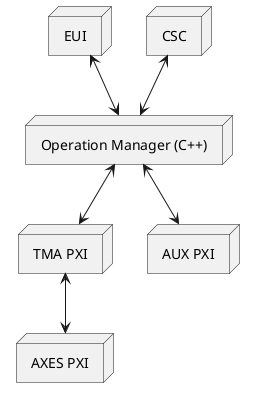
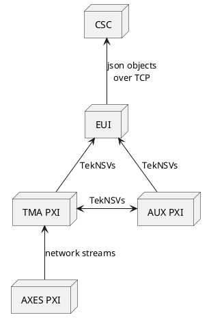
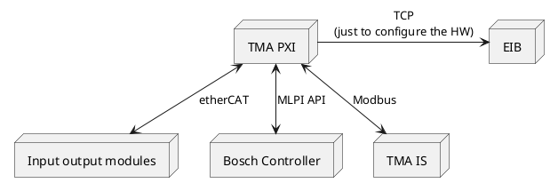
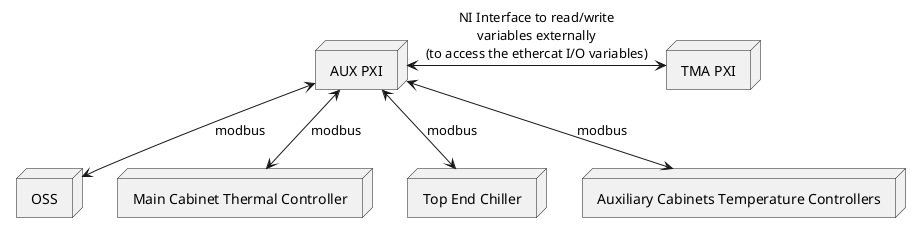
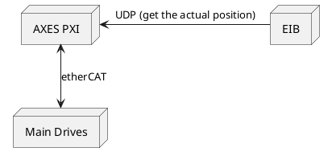
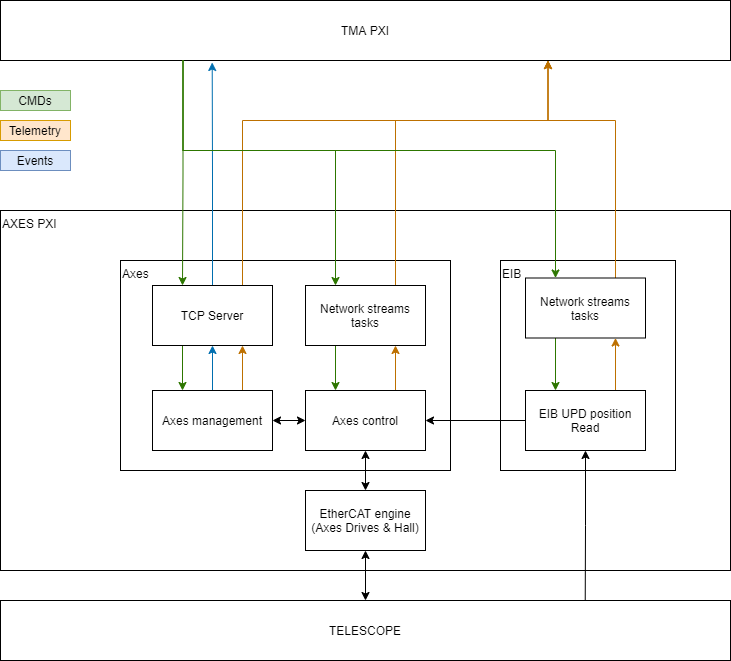

# Real Time Code Structure

## Structure diagrams

### Commands, responses and events

The commands are sent using TCP connections with a custom TCP protocol,
[command format](https://ts-tma.lsst.io/docs/tma_pxi-controller_documentation/02%20CommandsAndEventsManagement/03%20Commands.html#command-format)
[events](https://ts-tma.lsst.io/docs/tma_pxi-controller_documentation/02%20CommandsAndEventsManagement/04%20Events.html)
[responses](https://github.com/lsst-ts/ts_tma_operation-manager_mt-mount-operation-manager/blob/develop/tma_management/doc/protocol.md#events)

```plantuml
@startuml Structure commands, responses and events

node "Operation Manager (C++)" as cpp
node EUI
node CSC
node "TMA PXI" as tma_pxi
node "AUX PXI" as aux_pxi
node "AXES PXI" as axes_pxi

EUI <--> cpp
CSC <--> cpp
cpp <--> tma_pxi
tma_pxi <--> axes_pxi
cpp <--> aux_pxi

@enduml
```

### Telemetry

For reading the telemetry different communication methods and protocols are used.

```plantuml
@startuml Structure telemetry

node EUI
node CSC
node "TMA PXI" as tma_pxi
node "AUX PXI" as aux_pxi
node "AXES PXI" as axes_pxi

CSC <-- EUI : "json objects\nover TCP"
EUI <-- tma_pxi : "TekNSVs"
EUI <-- aux_pxi : "TekNSVs"
tma_pxi <-> aux_pxi : "TekNSVs"
tma_pxi <-- axes_pxi : "network streams"

@enduml
```

### Other communications

#### TMA PXI

```plantuml
@startuml TMA PXI other comms

node "TMA PXI" as tma_pxi
node EIB
node "Input output modules" as io
node "Bosch Controller" as bosch
node "TMA IS" as safety


tma_pxi <--> io : "etherCAT"
tma_pxi <--> bosch : "MLPI API"
tma_pxi <--> safety : "Modbus"
tma_pxi -> EIB : "TCP\n(just to configure the HW)"

@enduml
```

#### AUX PXI

```plantuml
@startuml AUX PXI other comms

node "AUX PXI" as aux_pxi
node "TMA PXI" as tma_pxi
node OSS
node "Main Cabinet Thermal Controller" as mcab
node "Top End Chiller" as tec
node "Auxiliary Cabinets Temperature Controllers" as auxiliary

aux_pxi <-> tma_pxi : "NI Interface to read/write\nvariables externally\n(to access the ethercat I/O variables)"
aux_pxi <--> OSS : "modbus"
aux_pxi <--> mcab : "modbus"
aux_pxi <--> auxiliary : "modbus"
aux_pxi <--> tec : "modbus"

@enduml
```

#### AXES PXI

```plantuml
@startuml AXES PXI other comms

node "AXES PXI" as axes_pxi
node EIB
node "Main Drives" as drives

axes_pxi <--> drives : "etherCAT"
axes_pxi <- EIB : "UDP (get the actual position)"

@enduml
```

## TMA and AUX PXIs code

These PXIs receive commands from the Operation Manager, and the state machine of the subsystems will process those commands.
The PXIs also check for event generation that will be sent to the Operation Manager. Also the telemetry generated in the
PXIs subsystem tasks, or in the AXES PXI will be sent to the EUI using TekNSVs.

- TCP Server: this component is instanciated both in the TMA and AUX PXIs and connects over TCP to
  send and receive the TCP messages from the Operation Manager. The message to send is specified to the
  task by a public method of the TCP server object, and the received messages
  are published in a user event created when the object is initialized.

- CommandReceiver: this component is the one receiving the commands from the TCP server and triggering the corresponding state
machines for each of them. This is done using the TCP server component.

- Events: this component is the one sending events to the Operation Manager. This is done using the TCP server component.

- TekNSVs: a custom variable protocol developed by Tekniker to replace the Network shared variables used for
  telemetry. This module collects data from several the running subsystems and leaves it ready for EUI to read.

- EtherCAT engine (only in the TMA PXI): LabVIEW software module used to read/write values of the inputs/outputs of the distributed I/Os.
  This module will receive data from several modules and will change the outputs to meet the desired value. It also will
  update the values of the inputs making them accessible for all modules.

- Main Axes (only in the TMA PXI): this component is the one used to manage the axes. In this component a task for each axis state machine,
  the EIB management module, monitoring task for each axis and the Azimuth Cable Wrap subsystem module. Note that the
  Azimuth Cable Wrap module is one of the Subsystems over Bosch modules that will be mentioned later. Commands for this
  subsystems are received from the CommandReceiver and will execute it managing the axis (the controller for the axis is
  in the AXES PXI), or sending it to EIB management module or Azimuth Cable Wrap module. To manage the axes a TCP Client
  is used, while the telemetry for the axes and EIB as well as to manage the EIB task in the AXES PXI network streams are
  used. Any event generated in different modules of the Main Axes module will be sent to Events module.

- Subsystems over Bosch (only in the TMA PXI): this is a set of modules. There is a module for each subsystem that uses
  bosch drivers. This modules will receive the commands from the CommandReceiver (or azimuth state machine in the special case of the azimuth
  cable wrap) and it will execute the command sending necessary commands to the Bosch Task module. Any generated events
  will be sent to the Events module (except for the azimuth cable wrap that will send ack, done, superseded and not success to
  the azimuth state machine). The subsystems that are in this category are:
  - Azimuth Cable Wrap
  - Camera Cable Wrap
  - Mirror Cover
  - Mirror Cover locks
  - Locking Pins
  - Balancing System
  - Deployable Platforms

- Subsystems over Modbus: this is a set of modules. There is a module for each subsystem that connects to an element
  using modbus tcp. This modules will receive the commands from the CommandReceiver (except the safety module that could
  receive also commands from other subsystems modules) and it will execute the command sending necessary commands element
  using a Modbus Task. Any generated event will be sent to Events module. The subsystems that are in this category are:
  - OilSupplySystem (only in the AUX PXI)
  - Safety (only in the TMA PXI)
  - Modbus TemperatureControllers (only in the AUX PXI)
  - Main Cabinet (only in the AUX PXI)
  - Top end chiller (only in the AUX PXI)
  
- Subsystems over EtherCAT: this is a set of modules. There is a module for each subsystem that connects to an element
  using EtherCAT. This modules will receive the commands from the CommandReceiver and it will execute the command updating
  the values of the EtherCAT outputs via EtherCAT engine. Any generated event will be sent to Events module. The subsystems
  that are in this category are:
  - Phase Power Supply (only in the AUX PXI)
  - Azimuth Drives Thermal (only in the AUX PXI)
  - Elevation Drives Thermal (only in the AUX PXI)
  - Cabinet 0101 Thermal (only in the AUX PXI)
  - Bosch Power Supply (only in the TMA PXI)

  > here for the modules running in the AUX PXI that access the etherCAT variables from the TMA PXI, LabVIEW uses a
  > similar approach to the NSVs but these are not NSVs

- TCP client and Network streams tasks (only in the TMA PXI):  this modules will send/receive data to/from the AXES PXI. This modules will be
  explained in the Main Axes software module.

- Modbus Tasks. There is a modbus task for each element communicated over modbus Ethernet. This modules will be explained
  in the corresponding software module, but they will interface the element with the subsystem software component.

- Bosch Task module (only in the TMA PXI): this component manage the communication with bosch drivers. This task receives commands from
  subsystems over bosch and send back the events to them. Drives telemetry is published in this module using the network
  shared variables engine.

- Telemetry Task (only in the AUX PXI): this component reads data from EtherCAT inputs that are not relevant for any
  subsystem and publish data as telemetry using TekNSVs. As this module is running in the AUX PXI accesses the etherCAT
  variables from the TMA PXI, using the previously mentioned NSVs similar approach.

## AXES PXI code

The AXES PXI receives commands from the TMA PXI. The tasks in this PXI are mainly to manage the axes

As shown in the figure above, the components of the AXES PXI real time code are:

- TCP Server: this component is the one the TCP client in the TMA PXI connects to send and receive commands for the axes
management. The message to send is specified to the task by a public method of the TCP server object, and the received
messages are published in a user event created when the object is initialized. This commands includes some monitoring
requests.

- Network Streams Tasks: there are several task with network streams. Some of them are used to receive commands from
TMA PXI and some other are used for telemetry proposes, sending the telemetry data to TMA PXI.
  
- Axes management: this component will manage the axis behavior at low level. It is also the responsible of generating
the trajectory for point to point movements, constant speed movements and tracking.

- Axes Control: this component will execute the control algorithm taking data from axes management and EIB UDP position
Read, and managing the axis drives. The axis drives are managed via EtherCAT engine

- EtherCAT engine: LabVIEW software module used to read/write values of the inputs/outputs of the drives and hall effect
sensors. This module will receive data from Axes control module and will change the outputs to meet the desired value.
Also, it will update the values of the inputs making them accessible for Axes control module.
  - The EtherCAT engine also provide the interface in the ATS for some simulated EIB variables simulated in the SpeedGoat

- EIB UPD position Read: this component reads data from the EIB. This data is sent via UDP when the EIB management
module activates the data transmission. The received data is processed and published via Network Streams and a public
method for Axes controls. This module could receive some commands from TMA PXI via a Network Stream task.
