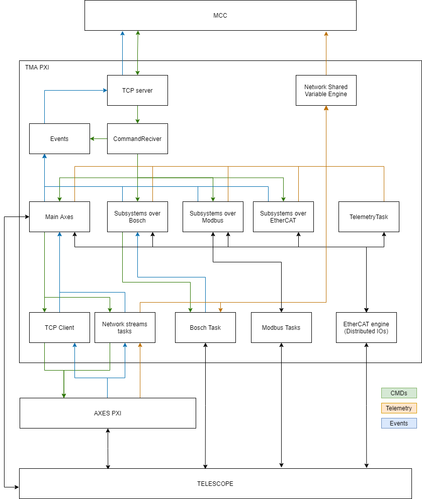

# Real Time Code Structure

The real time code is an important part of the overall system, as
seen in Figure \ref{figureone350f30df820b4ef01f38b7cadcba9985} where the real time code corresponds to the TMA PXI (the real time controller that manages the state machines of all the TMA systems) and the AXES PXI (the real time controller that manages the main axes loops, AZ and EL) labels.

The real time part is divided in two different hardwares, the TMA PXI and the AXES PXI. 

## TMA PXI code

The TMA PXI receives commands from the TMA OMT, and the state machine of the subsystems will process those commands. The TMA PXI also will check for event generation that will be sent to the TMA OMT. Also the telemetry generated in the TMA PXI subsystem tasks, or in the AXES PXI will be sent to the HMIs using network shared variables.

As shown in Figure \ref{TMAPXISoftwareStructure}, the components of the TMA PXI real time code are:

- TCP Server: this component is the one the TMA connects to over TCP to
 send and receive the TCP messages. The message to send is specified to the
 task by a public method of the TCP server object, and the received messages
 are published in a user event created when the object is initialized.

- CommandReceiver: this component is the one receiving the commands from the TMA and triggering the corresponding state machines for each of them. This is done using the TCP server component.

- Events: this component is the one sending events to the TMA. This is done using the TCP server component.

- Network Shared Variable Engine: LabVIEW software module that allows managing the Network shared variables used for telemetry. This module receive data from several modules and leave them ready for HMIs to read.

- EtherCAT engine: LabVIEW software module used to read/write values of the inputs/outputs of the distributed I/Os. This module will receive data from several modules and will change the outputs to meet the desired value. It also will update the values of the inputs making them accessible for all modules.

- Main Axes: this component is the one used to manage the axes. In this component a task for each axis state machine, the EIB management module, monitoring task for each axis and the Azimuth Cable Wrap subsystem module. Note that the Azimuth Cable Wrap module is one of the Subsystems over Bosch modules that will be mentioned later. Commands for this subsystems are received from the CommandReceiver and will execute it managing the axis (the controller for the axis is in the AXES PXI), or sending it to EIB management module or Azimuth Cable Wrap module. To manage the axes a TCP Client is used, while the telemetry for the axes and EIB as well as to manage the EIB task in the AXES PXI network streams are used. Any event generated in different modules of the Main Axes module will be sent to Events module.

- Subsystems over Bosch: this is a set of modules. There is a module for each subsystem that use bosch drivers. This modules will receive the commands from the CommandReceiver (or azimuth state machine in the special case of the azimuth cable wrap) and it will execute the command sending necessary commands to the Bosch Task module. Any generated event will be sent to Events module (except for the azimuth cable wrap that will send ack, done, superseded and not success to the azimuth state machine). The subsystems that are in this category are:
  - Azimuth Cable Wrap
  - Camera Cable Wrap
  - Mirror Cover
  - Mirror Cover locks
  - Locking Pins
  - Balancing System
  - Deployable Platforms 

- Subsystems over Modbus: this is a set of modules. There is a module for each subsystem that connects to an element using modbus tcp. This modules will receive the commands from the CommandReceiver (except the safety module that could receive also commands from other subsystems modules) and it will execute the command sending necessary commands element using a Modbus Task. Any generated event will be sent to Events module. The subsystems that are in this category are:
  - OilSupplySystem
  - Safety
  - Modbus TemperatureControllers
  - Main Cabinet
  - Top end chiller
  
- Subsystems over EtherCAT: this is a set of modules. There is a module for each subsystem that connects to an element using EtherCAT. This modules will receive the commands from the CommandReceiver and it will execute the command updating the values of the EtherCAT outputs via EtherCAT engine. Any generated event will be sent to Events module. The subsystems that are in this category are:
  - Phase Power Supply
  - Azimuth Drives Thermal
  - Elevation Drives Thermal
  - Cabinet 0101 Thermal
  - Bosch Power Supply
  
- TCP client and Network streams tasks:  this modules will send/receive data to/from the AXES PXI. This modules will be explained in the Main Axes software module.

- Modbus Tasks. There is a modbus task for each element communicated over modbus Ethernet. This modules will be explained in the corresponding software module, but they will interface the element with the subsystem software component.

- Bosch Task module: this component manage the communication with bosch drivers. This task receives commands from subsystems over bosch and send back the events to them. Drives telemetry is published in this module using the network shared variables engine.

- Telemetry Task: this component read data from EtherCAT inputs that are not relevant for any subsystem and publish data as telemetry using the network shared variables engine.

## AXES PXI code

The AXES PXI receives commands from the TMA PXI. The tasks in this PXI are mainly to manage the axes

As shown in Figure \ref{AXESPXISoftwareStructure}, the components of the AXES PXI real time code are:

- TCP Server: this component is the one the TCP client in the TMA PXI connects to send and receive commands for the axes management. The message to send is specified to the task by a public method of the TCP server object, and the received messages are published in a user event created when the object is initialized. This commands includes some monitoring requests.

- Network Streams Tasks: there are several task with network streams. Some of them are used to receive commands from TMA PXI and some other are used for telemetry proposes, sending the telemetry data to TMA PXI.
  
- Axes management: this component will manage the axis behavior at low level. It is also the responsible of generating the trajectory for point to point movements, constant speed movements and tracking.

- Axes Control: this component will execute the control algorithm taking data from axes management and EIB UDP position Read, and managing the axis drives. The axis drives are managed via EtherCAT engine

- EtherCAT engine: LabVIEW software module used to read/write values of the inputs/outputs of the drives and hall effect sensors. This module will receive data from Axes control module and will change the outputs to meet the desired value. Also, it will update the values of the inputs making them accessible for Axes control module.
  - The EtherCAT engine also provide the interface in the ATS for some simulated EIB variables simulated in the SpeedGoat

- EIB UPD position Read: this component reads data from the EIB. This data is sent via UDP when the EIB management module activates the data transmission. The received data is processed and published via Network Streams and a public method for Axes controls. This module could receive some commands from TMA PXI via a Network Stream task.