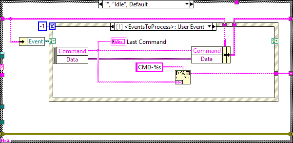

## TCP Client

This component is the one the TMA connects to over TCP to
 send and receive the TCP messages. The message to send is specified to the
 task by a public method of the TCP server object, and the received messages
 are published in a user event created when the object is initialized. These events are then
registered by another task to filter then and generate the proper triggers to the corresponding state machines within the application.

For this component, the Server.lvclass is used. This class is explained in
[this section](#server.lvclass) in a generic way, as this task can be used in many different ways
depending on the configuration set to it.

### Component Configuration

As explained in [this section](#configuration-file-explained) the Server.lvclass requires a *\*.xml* file to
specify the configuration of the task. For this specific case, the used
configuration is specified in the “*CommandTCP_Config.xml*” file located at the
Configuration folder inside the PXIController repo (RT Code -> Configuration -> CAR_TCP).

The values of this configuration can be modified to improve the performance or if you need to change the port used to communicate to the TMA OMT (operation_manager).

### Server.lvclass

This class when initialized launches a task that contains a TCP server. The
class main elements are explained in the following sections.

#### How to use

This section explains how to use the Server.lvclass.

1. Create a configuration file with the desired configuration.
2. Add the Server_Init.vi to initialize the TCP server and pass to it the path to the previously defined config file.
3. This init will return a reference to a user event where the received TCP messages are going to be published. Register this event in a event structure to get the TCP messages.
4. For sending TCP messages to the clients there are two options:

  - SendDataTCP.vi: this vi sends the specified message to the specified client. The client is identified with a connection reference ID (i32).
  - SendDataTCP2All.vi: this vi sends the specified message to all the connected clients.

5. For exiting use the CleanUp.vi.

#### Configuration file explained

This task requires from a configuration file for initialization, in**.xml*
format that contains the following sections:

- Service_Name: the name you want to set to the server, default is empty.

- Port: the port of the server the clients will connect to.

- Listen_Timeout_in_ms: timeout for listening to new clients.

- Receive_Timeout_in_ms: timeout for reading from TCP clients, this timeout is
    set to check every client.

- BytesToRead: bytes to read from TCP.

- ReadMode: here the read mode is configured, the options are: ``sel='Standard'\>0; sel='Buffered'\>1; sel='CRLF'\>2; sel='Immediate'\>3``

#### Task process

This task was created using the NI GOOP Developing Suite, this task is object
oriented and the communication between methods is done using queues and user
events. The task main is contained in the process.vi, here there are three
loops, see Figure \ref{serverProcessBlockDiagram}.

- The loop on top is used for CMD reception.

- The TCP Listening Loop, is the one reading the TCP connections from the clients for any new data.

- New Connection Manager loop, is the one managing the new client connections.

##### Task methods

Here the available methods for this task are explained.

###### Server_Init

Initialize the TCP server task.

If you have an XML with multiple configurations use the TypeDefName input to search for the configuration for this specific case, leave empty if you want to use the default searching string.

###### CleanUp

Stop the process

###### ControlProcessWindow

This VI is used to show or hide the process front panel. Depending on the
ShowProcessWindow control value.

###### SendDataTCP

Send the specified message to the specified TCP client, the identification of the client is done using the ConnectionID (i32).

###### SendDataTCP2All

Send the specified TCP message to all the connected TCP clients.

##### CMD Reception loop

This loop receives the CMDs from the methods and passes the required actions to
the corresponding loop.

#### Init

Here the local variables are initialized to the default values.

###### Idle

This state is executed constantly after executing every new CMD, here the events
created at the methods are received and executed in the next iteration.

###### Timeout

This state is executed when there is something that must be executed in the
specified timeout of the Idle state event structure.

###### ShowWindow

This state is used to show the front panel of the process.

###### HideWindow

This state is used to hide the front panel of the process.

###### CMD-SendData

This case is called from the SendDataTCP method. Here the specified message is
sent to the specified TCP client, the identification of the client is done using
the connection reference ID (i32) data to the process. The different client
connections are stored in a DVR and there the specified connection is searched,
if found the message is sent if not an error is sent as a response to the
method. If any error occurred during the process they are sent to the process as
a response.

###### CMD-SendData2All

This case is called from the SendDataTCP2All method. Here the specified message
is sent to all the TCP clients. If any error occurred during the process they
are sent to the process as a response.

###### Shutdown

This state is reached when the shutdown CMD is received. This loop is used to
stop the process.

###### Error

This state is reached when an error occurs at the task, here the error is
published, into a user event that can be registered by the calling task, and
cleared for the next iteration.

##### The TCP Listening Loop

This loop is responsible of publishing the telemetry over TCP. This loop
contains a very simple state machine with 5 states, each of them is explained in
the upcoming sections.

###### Initialize

###### StatusCheck

Here the connected clients are checked:

- If there are no clients connected the next state is StatusCheck

- If there are clients connected the next state is ListenCommands

###### ListenCommands

Here the messages from the connected clients are obtained, and if any client is
no longer available the client is removed from the active clients.

The next state is always StatusCheck.

###### ErrorHandling

Here the same VI from the Error case in the CMD reception loop is used to
publish the error as an event.

The next state is always StatusCheck.

###### Exit

Here all the connections are closed and the loop is stopped.

There is no next state after this case.

##### New Connection Manager

This loop is responsible of managing the new TCP client connections. This loop
contains a very simple state machine with 5 states, each of them is explained in
the upcoming sections.

###### Initialize

Here the TCP server is initialized.

The next state is always WaitNewConnection.

###### WaitNewConnection

Here the server waits for new TCP client connections.

The next state is always CheckExit.

###### CheckExit

Here the local variable Stop is checked to stop the loop.

- If TRUE the next state is Exit.

- If FALSE the next state is WaitNewConnection.

###### ErrorHandling

Here the following actions are done:

- All the connections are closed, and the server is stopped.

- The error is publish using the same VI from the Error case in the CMD reception loop.

The next state is always Initialize.

###### Exit

Here all the connections are closed and the loop is stopped.

There is no next state after this case.

