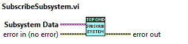

## Command Receiver

This component is the one receiving the commands from the TMA and triggering the corresponding state machines for each of them. This is done using the TCP server component.

This component also will reject any command that are not sent from the actual commander, and manage the actual commander logic.

The commander clock (it is a command actually) is also checked in this component and if clocks timeouts, then it will trigger all state machines subscribed to fault, unless those state machines are configured as not fault when subscribed.

All the elements of the component are in the TCPCMDReceiver.lvlib, except the dependency of TCP server component.

### TCPCMDReceiver.lvlib

The command is received using TCP server and the vis on this library will parse it, process and send to state machines if necessary.

All the commands are received by the TCP task that will produce an user event in the TCPCMDReceiver. This library will parse the command, and send to the subsystem if it is subscribed. There are two commands that are process directly by this module (clock and SetCommander).

The TCPCMDReceiver manages also the actual commander and the watchdog for the commander.

#### Task

The task has two loops. The first one is a state machine where the idle state is for receiving commands from tcp or from local machine (configuration, subscribe, unsubscribe and exit commands). All the commands are user events. If the received command is from tcp it will be server to the other loop (consumer loop) using a queue.

When a subsystem is subscribed it is stored in a DVR of arrays for all subscribed subsystems.

The consumer loop will deal with tcp commands. This loop is also a state machine where the dequeue of the queue is done GetCMDData state. Other states are to process the command, init, exit and error handling.

There are two commands processed locally:

* The clock command. It will reset the watchdog. If the watchdog time is overcome then the subscribed subsystem will faulted and the commander will be reset to "not configured"
* The SetCommander command. It will change the actual commander. This transition is not allowed if the commander is the HHD and the command is not from the HHD.


#### Public methods

In this section the public methods and their usage is explained

##### Init

Calling this VI will launch the task to receive the command via tcp. This vi needs

* **Server object:** A tcp server object already initialized as input.
* **DataFromTCP:** The user events reference DataFromTCp the initialization of the tcp server are inputs.
* **TaskError:** The user events reference DataFromTCp the initialization of the tcp server are inputs.
* **Actual Commander NSV:** The reference of the Actual commander variables is also needed to publish the actual commander.
* **Time To Delete Queue:** An optional input for time to delete queues. If there is no response from the statechart the task will flush the queue after this time, this way the statechart will accept new commands. If the time is fulfilled a warning is publish. The default value for this optional inputs is 2000ms.


##### CleanUp

This Vi will close the task and all the elements created by the library. The tcp server must be clean up separately.


##### SubscribeSubsystem

Calling this vi, the a subsystem is subscribed to receive commands. If a subsystem is subscribed commands received by the command receiver task can be redirected to this subsystem, otherwise the commands will be rejected by the command receiver task. If the subscription is not possible the error -66000 will be put in the error output.
This vi has only one input that is a structure with the next fields.

* **Subsystem Name:** Name to identify the subsystem
* **Minimum Command:** Minimum command of the set of commands attended by the subscribing subsystem
* **Maximum Command:** Maximum command of the set of commands attended by the subscribing subsystem
* **CommandObjects:** Array of CMDManagement objects. There is an object per subsystem instance.
* **Send Faults:** If True (default) a fault will be sent to the subsystem if the commander watchdog is triggered



##### UnsubscribeSubsystem

Calling this VI a subscribed subsystem can be unsubscribe to stop receiving commands from the command reception task. If the unsubscribing is not possible the error -66000 will be put in the error output.
This vi only needs the identification of the subscribed subsystem

* **Subsystem name:** Name that identified the subsystem when subscribed.


##### SeCommanderClock

This VI allows to change the default 5000 ms time for the commander watchdog

* **Time To Fault:** Watchdog time in ms. If the elapsed time between two clock commands from the commander is bigger than this time a fault will be triggered in all subscribed subsystem with this option active


#### Available commands

This section contains the format of the commands and the list of the available commands with the parameters for each command.

##### Command format

The field separator character is the Line Feed (\n) and the end-of-message indicator is a Carriage Return followed by a Line Feed (\r\n).
A command must have the following format when it's sent to the OperationManager from any Commander (EUI, HHD, CSC):

``` command
<Seq_id>\n<Cmd_Id>\n<Source>\n<Timestamp>[\n<Param_1>\n<Param_2>\n ... <Param_n>\n]\r\n
```

where:

* **Seq_id**: A number that uniquely identifies the command message.
* **Cmd_id**: The type of command identification number(defined in types.h).
* **Source**: ID number of the command sender (1 = CSC, 2 = MCS, 3 = HDD, 100 = PXIs).
* **Timestamp**: Timestamp in ISO-8601 format (e.g. 2016-05-31T10:44:35.321436).
* **Param_1 ... Param_n**: Parameters of the command (this may or may not exist, depending on the command).

Example of a command:

``` command
342\n1\n101\n2\n2017-07-14T16:13:34.378333\n0\r\n
```

(An AZ_AXIS_POWER command is sent with the power parameter set to off 0.)

But the actual command that reaches the PXIs, sent from the OperationManager, has an extra sequence id at the beginning.
This sequence is the OperationManager identifier for that specific command. Check format bellow:

``` command
<OperationManager_Seq_id>\n<Seq_id>\n<Cmd_Id>\n<Source>\n<Timestamp>[\n<Param_1>\n<Param_2>\n ... <Param_n>\n]\r\n
```

##### Commands available to be sent to the PXIs

Here the list of the available commands the PXI can receive are listed, note that this list may differ a bit from the
available commands at the OperationManager, as it has some higher level commands that split into lower level commands
listed here and some others specific to the OperationManager. To see the list of available commands for the OperationManager check
[this json file](https://gitlab.tekniker.es/aut/projects/3151-LSST/OperationManager/lsst/-/blob/develop/tma_management/commands_definitions.json).

PXI commands:

* AZ_AXIS_POWER
  * Id: 101
  * Param_1: PowerOn[1]/PowerOff[0]
* AZ_AXIS_STOP
  * Id: 102
* AZ_AXIS_MOVE
  * Id: 103
  * Param_1: Position (deg, float)
  * Param_2: Speed (deg/s, float)
  * Param_3: Acceleration (deg/s^2, float)
  * Param_4: Jerk (deg/s^3, float)
* AZ_AXIS_MOVE_VELOCITY
  * Id: 104
  * Param_1: Speed percentage of the default speed [-100 to 100] (%, float)
* AZ_AXIS_TRACKING
  * Id: 105
  * Param_1: Position (deg, float)
  * Param_2: Speed (deg/s, float)
  * Param_3: Time (s, float)
* AZ_AXIS_HOME
  * Id: 106
* AZ_AXIS_RESET_ALARM
  * Id: 107
* AZ_AXIS_ENABLE_TRACK
  * Id: 108
  * Param_1: Enable[1]/Disable[0]
* TF_AZ_EXCITATION
  * Id: 131
  * Param_1: On[1]/Off[0]
  * Param_2: Position Amplitude (deg/s, float)
  * Param_3: Speed Amplitude (deg/s^2, float)
  * Param_4: Torque Amplitude (Nm, float)
  * Param_5: Excitation Mode [Torque: 0, Speed: 1, Position: 2]
  * Param_6: Excitation Type [WhiteNoise: 0, Sine: 1]
  * Param_7: Sine Frequency (Hz, float)
* TF_AZ_DAMPING_EXCITATION
  * Id: 132
  * Param_1: On[1]/Off[0]
  * Param_2: X Torque Amplitude (Nm, float)
  * Param_3: Y Torque Amplitude (Nm, float)
  * Param_5: Excitation Mode [X direction: 0, Y direction: 1]
  * Param_6: Excitation Type [WhiteNoise: 0, Sine: 1]
  * Param_7: Sine Frequency (Hz, float)
* AZ_DRIVE_RESET
  * Id: 201
* AZ_DRIVE_ENABLE
  * Id: 202
  * Param_1: Enable[1]/Disable[0]

* AZ_CW_POWER
  * Id: 301
  * Param_1: PowerOn[1]/PowerOff[0]
* AZ_CW_STOP
  * Id: 302
* AZ_CW_MOVE
  * Id: 303
  * Param_1: Position (deg, float)
  * Param_2: Speed (deg/s, float)
  * Param_3: Acceleration (deg/s^2, float)
  * Param_4: Jerk (deg/s^3, float)
* AZ_CW_MOVE_VELOCITY
  * Id: 304
  * Param_1: Speed percentage of the default speed [-100 to 100] (%, float)
* AZ_CW_TRACK_AZIMUTH
  * Id: 305
  * Param_1: Position (deg, float)
  * Param_2: Speed (deg/s, float)
  * Param_3: Time (s, float)
* AZ_CW_RESET_ALARM
  * Id: 306
* AZ_CW_DRIVE_RESET
  * Id: 307
* AZ_CW_DRIVE_ENABLE
  * Id: 308
  * Param_1: Select the drive to be enabled [Drive_1: 1, Drive_2: 2]
* AZ_CW_ENABLE_TRACK_AZIMUTH
  * Id: 309

* EL_AXIS_POWER
  * Id: 401
  * Param_1: PowerOn[1]/PowerOff[0]
* EL_AXIS_STOP
  * Id: 402
* EL_AXIS_MOVE
  * Id: 403
  * Param_1: Position (deg, float)
  * Param_2: Speed (deg/s, float)
  * Param_3: Acceleration (deg/s^2, float)
  * Param_4: Jerk (deg/s^3, float)
* EL_AXIS_MOVE_VELOCITY
  * Id: 404
  * Param_1: Speed percentage of the default speed [-100 to 100] (%, float)
* EL_AXIS_TRACKING
  * Id: 405
  * Param_1: Position (deg, float)
  * Param_2: Speed (deg/s, float)
  * Param_3: Time (s, float)
* EL_AXIS_HOME
  * Id: 406
* EL_AXIS_RESET_ALARM
  * Id: 407
* EL_AXIS_ENABLE_TRACK
  * Id: 408
  * Param_1: Enable[1]/Disable[0]
* TF_EL_EXCITATION
  * Id: 431
  * Param_1: On[1]/Off[0]
  * Param_2: Position Amplitude (deg/s, float)
  * Param_3: Speed Amplitude (deg/s^2, float)
  * Param_4: Torque Amplitude (Nm, float)
  * Param_5: Excitation Mode [Torque: 0, Speed: 1, Position: 2]
  * Param_6: Excitation Type [WhiteNoise: 0, Sine: 1]
  * Param_7: Sine Frequency (Hz, float)
* EL_DRIVE_RESET
  * Id: 501
* EL_DRIVE_ENABLE
  * Id: 502
  * Param_1: Select the drive to be enabled [Drive_1: 1, Drive_2: 2]

* MPS_POWER
  * Id: 601
  * Param_1: PowerOn[1]/PowerOff[0]
* MPS_RESET_ALARM
  * Id: 602

* EIB_POWER
  * Id: 701
  * Param_1: Axis ident [AZ: 0, EL: 1]
  * Param_2: PowerOn[1]/PowerOff[0]
* EIB_STOP_REFERENCE
  * Id: 702
  * Param_1: Axis ident [AZ: 0, EL: 1]
* EIB_HARDWARE_REBOOT
  * Id: 703
* EIB_RESET_ERROR
  * Id: 704
  * Param_1: Axis ident [AZ: 0, EL: 1]
* EIB_CLEAR_POSITION_ERROR
  * Id: 705
  * Param_1: Axis ident [AZ: 0, EL: 1]
* EIB_EXIT
  * Id: 706
* EIB_START_REFERENCE
  * Id: 707
  * Param_1: Axis ident [AZ: 0, EL: 1]

* OSS_POWER
  * Id: 801
  * Param_1: PowerOn[1]/PowerOff[0]
* OSS_POWER_COOLING
  * Id: 802
  * Param_1: PowerOn[1]/PowerOff[0]
* OSS_POWER_OIL
  * Id: 803
  * Param_1: PowerOn[1]/PowerOff[0]
* OSS_POWER_MAIN_PUMP
  * Id: 804
  * Param_1: PowerOn[1]/PowerOff[0]
* OSS_RESET_ALARM
  * Id: 805
* OSS_CHANGE_MODE
  * Id: 806
  * Param_1: change between auto and manual [Manual: 0, Auto: 1]
* OSS_ABORT_POWERING
  * Id: 807
* OSS_IO_CABINETS_TEMPERATURE_SETPOINT
  * Id: 808
  * Param_1: Temperature setpoint value (C degrees, float)

* MC_POWER
  * Id: 901
  * Param_1: mirror cover ident [All: -1, X+: 0, Y+: 1, X-: 2, Y-: 3]
  * Param_2: PowerOn[1]/PowerOff[0]
* MC_STOP
  * Id: 902
  * Param_1: mirror cover ident [All: -1, X+: 0, Y+: 1, X-: 2, Y-: 3]
* MC_MOVE
  * Id: 903
  * Param_1: mirror cover ident [All: -1, X+: 0, Y+: 1, X-: 2, Y-: 3]
  * Param_2: Position (deg, float)
  * Param_3: Speed (deg/s, float)
  * Param_4: Acceleration (deg/s^2, float)
  * Param_5: Jerk (deg/s^3, float)
* MC_MOVE_VELOCITY
  * Id: 904
  * Param_1: mirror cover ident [All: -1, X+: 0, Y+: 1, X-: 2, Y-: 3]
  * Param_2: Speed percentage of the default speed [-100 to 100] (%, float)
* MC_DEPLOY
  * Id: 905
  * Param_1: mirror cover ident [All: -1, X+: 0, Y+: 1, X-: 2, Y-: 3]
* MC_RETRACT
  * Id: 906
  * Param_1: mirror cover ident [All: -1, X+: 0, Y+: 1, X-: 2, Y-: 3]
* MC_RESET_ALARM
  * Id: 907
  * Param_1: mirror cover ident [All: -1, X+: 0, Y+: 1, X-: 2, Y-: 3]

* CAM_CW_POWER
  * Id: 1001
  * Param_1: PowerOn[1]/PowerOff[0]
* CAM_CW_STOP
  * Id: 1002
* CAM_CW_MOVE
  * Id: 1003
  * Param_1: Position (deg, float)
  * Param_2: Speed (deg/s, float)
  * Param_3: Acceleration (deg/s^2, float)
  * Param_4: Jerk (deg/s^3, float)
* CAM_CW_TRACK_CAMERA
  * Id: 1004
  * Param_1: Position (deg, float)
  * Param_2: Speed (deg/s, float)
  * Param_3: Time (s, float)
* CAM_CW_RESET_ALARM
  * Id: 1005
* CAM_CW_DRIVE_ENABLE
  * Id: 1006
  * Param_1: Select the drive to be enabled [Drive_1: 1, Drive_2: 2]
* CAM_CW_DRIVE_RESET
  * Id: 1007
* CAM_CW_MOVE_VELOCITY
  * Id: 1008
  * Param_1: Speed percentage of the default speed [-100 to 100] (%, float)
* CAM_CW_ENABLE_TRACK_CAMERA
  * Id: 1009

* BAL_POWER
  * Id: 1101
  * Param_1: balancing ident [All: -1, 0.X-: 0, 0.X+: 1, 90.X-: 2, 90.X+: 3]
  * Param_2: PowerOn[1]/PowerOff[0]
* BAL_STOP
  * Id: 1102
  * Param_1: balancing ident [All: -1, 0.X-: 0, 0.X+: 1, 90.X-: 2, 90.X+: 3]
* BAL_MOVE
  * Id: 1103
  * Param_1: balancing ident [All: -1, 0.X-: 0, 0.X+: 1, 90.X-: 2, 90.X+: 3]
  * Param_2: Position (mm, float)
  * Param_3: Speed (mm/s, float)
  * Param_4: Acceleration (mm/s^2, float)
  * Param_5: Jerk (mm/s^3, float)
* BAL_RESET_ALARM
  * Id: 1104
  * Param_1: balancing ident [All: -1, 0.X-: 0, 0.X+: 1, 90.X-: 2, 90.X+: 3]
* BAL_MOVE_VELOCITY
  * Id: 1105
  * Param_1: balancing ident [All: -1, 0.X-: 0, 0.X+: 1, 90.X-: 2, 90.X+: 3]
  * Param_2: Speed percentage of the default speed [-100 to 100] (%, float)

* DP_POWER
  * Id: 1201
  * Param_1: deployable platform ident [All: -1, X+: 0, X-: 1]
  * Param_2: PowerOn[1]/PowerOff[0]
* DP_STOP
  * Id: 1202
  * Param_1: deployable platform ident [All: -1, X+: 0, X-: 1]
* DP_MOVE_VELOCITY
  * Id: 1204
  * Param_1: deployable platform ident [All: -1, X+: 0, X-: 1]
  * Param_2: Speed percentage of the default speed [-100 to 100] (%, float)
* DP_RESET_ALARM
  * Id: 1205
  * Param_1: deployable platform ident [All: -1, X+: 0, X-: 1]
* DP_LOCK_EXTENSION
  * Id: 1206
  * Param_1: deployable platform ident [All: -1, X+: 0, X-: 1]
  * Param_2: extension ident [M2: 0, M1M3: 1]
  * Param_3: Lock[1]/Unlock[0]
* DP_EXTEND_RETRACT
  * Id: 1207
  * Param_1: deployable platform ident [All: -1, X+: 0, X-: 1]
  * Param_2: Extend[1]/Retract[0]

* CABINET_TRACK_AMBIENT
  * Id: 1301
  * Param_1: TrackTrue[1]/TrackFalse[0]
  * Param_2: Temperature setpoint value (C degrees, float)
* CABINET_RESET_ALARM
  * Id: 1302
* CABINET_UPDATE_AMBIENT
  * Id: 1303
  * Param_1: ambient temperature value (C degrees, float)

* LP_POWER
  * Id: 1401
  * Param_1: locking pin ident [All: -1, X+: 0, X-: 1]
  * Param_2: PowerOn[1]/PowerOff[0]
* LP_STOP
  * Id: 1402
  * Param_1: locking pin ident [All: -1, X+: 0, X-: 1]
* LP_MOVE
  * Id: 1403
  * Param_1: locking pin ident [All: -1, X+: 0, X-: 1]
  * Param_2: Position (mm, float)
  * Param_3: Speed (mm/s, float)
  * Param_4: Acceleration (mm/s^2, float)
  * Param_5: Jerk (mm/s^3, float)
* LP_MOVE_VELOCITY
  * Id: 1404
  * Param_1: locking pin ident [All: -1, X+: 0, X-: 1]
  * Param_2: Speed percentage of the default speed [-100 to 100] (%, float)
* LP_RESET_ALARM
  * Id: 1405
  * Param_1: locking pin ident [All: -1, X+: 0, X-: 1]
* LP_MOVE_ALL
  * Id: 1406
  * Param_1: locking pin ident [All: -1, X+: 0, X-: 1]
  * Param_2: move to stored positions [Lock: 0, Test: 1, Free: 2]

* MCL_POWER
  * Id: 1501
  * Param_1: mirror cover lock ident [All: -1, X+: 4, Y+: 5, X-: 6, Y-: 7]
  * Param_2: PowerOn[1]/PowerOff[0]
* MCL_STOP
  * Id: 1502
* MCL_MOVE
  * Id: 1503
  * Param_1: mirror cover lock ident [All: -1, X+: 4, Y+: 5, X-: 6, Y-: 7]
  * Param_2: Position (deg, float)
  * Param_3: Speed (deg/s, float)
  * Param_4: Acceleration (deg/s^2, float)
  * Param_5: Jerk (deg/s^3, float)
* MCL_MOVE_VELOCITY
  * Id: 1504
  * Param_1: mirror cover lock ident [All: -1, X+: 4, Y+: 5, X-: 6, Y-: 7]
  * Param_2: Speed percentage of the default speed [-100 to 100] (%, float)
* MCL_RESET_ALARM
  * Id: 1505
  * Param_1: mirror cover lock ident [All: -1, X+: 4, Y+: 5, X-: 6, Y-: 7]
* MCL_MOVE_ALL
  * Id: 1506
  * Param_1: mirror cover lock ident [All: -1, X+: 4, Y+: 5, X-: 6, Y-: 7]
  * Param_2: Unlock[1]/Lock[0]
* MCL_LOCK
  * Id: 1507
  * Param_1: mirror cover lock ident [All: -1, X+: 4, Y+: 5, X-: 6, Y-: 7]
* MCL_UNLOCK
  * Id: 1508
  * Param_1: mirror cover lock ident [All: -1, X+: 4, Y+: 5, X-: 6, Y-: 7]

* AZ_THERMAL_POWER
  * Id: 1601
  * Param_1: azimuth drive group ident [All: -1, Group_1: 0, Group_2: 1, Group_3: 2, Group_4: 3]
  * Param_2: PowerOn[1]/PowerOff[0]
* AZ_THERMAL_CONTROL_MODE
  * Id: 1602
  * Param_1: azimuth drive group ident [All: -1, Group_1: 0, Group_2: 1, Group_3: 2, Group_4: 3]
  * Param_2: control type [TrackAmbient: 0, TrackSetpoint: 1, ManageValveSetpoint: 2, ManageAutoTune: 3]
  * Param_3: depends on the control type:
    * TrackAmbient: not used
    * TrackSetpoint: Temperature setpoint value (C degrees, float)
    * ManageValveSetpoint: valve setpoint value [0-100] (%, float)
    * ManageAutoTune: AutoTuneStart[1]/AutoTuneStop[0]
* AZ_THERMAL_RESET_ALARM
  * Id: 1603
  * Param_1: azimuth drive group ident [All: -1, Group_1: 0, Group_2: 1, Group_3: 2, Group_4: 3]

* EL_THERMAL_POWER
  * Id: 1701
  * Param_1: elevation drive group ident [All: -1, Group_1: 0, Group_2: 1]
  * Param_2: PowerOn[1]/PowerOff[0]
* EL_THERMAL_CONTROL_MODE
  * Id: 1702
  * Param_1: elevation drive group ident [All: -1, Group_1: 0, Group_2: 1]
  * Param_2: control type [TrackAmbient: 0, TrackSetpoint: 1, ManageValveSetpoint: 2, ManageAutoTune: 3]
  * Param_3: depends on the control type:
    * TrackAmbient: not used
    * TrackSetpoint: Temperature setpoint value (C degrees, float)
    * ManageValveSetpoint: valve setpoint value [0-100] (%, float)
    * ManageAutoTune: AutoTuneStart[1]/AutoTuneStop[0]
* EL_THERMAL_RESET_ALARM
  * Id: 1703
  * Param_1: elevation drive group ident [All: -1, Group_1: 0, Group_2: 1]

* SAFETY_RESET
  * Id: 1801
  * Param_1: causes to reset, index value obtained from safety matrix [0-39] (int) for more than one separate integers
  by `:`. Example for three causes reset: `<cause1Index>:<cause2Index>:<cause3Index>`
* OVERRIDE_CAUSES
  * Id: 1802
  * Param_1: causes to override, index value obtained from safety matrix [0-39] (int) for more than one separate integers by `:`.
  In addition, this command has the override on[1]/off[0] value as a starter. This gives the following parameter for
  an override set: `1:<causeIndex>` and this for an override release: `0:<causeIndex>`.
  Example for three causes override set: `1:<cause1Index>:<cause2Index>:<cause3Index>`.
  Example for three causes override release: `0:<cause1Index>:<cause2Index>:<cause3Index>`.

* CABINET0101_THERMAL_POWER
  * Id: 1901
  * Param_1: cabinet ident use 0 always
  * Param_2: PowerOn[1]/PowerOff[0]
* CABINET0101_THERMAL_CONTROL_MODE
  * Id: 1902
  * Param_1: cabinet ident use 0 always
  * Param_2: control type [TrackAmbient: 0, TrackSetpoint: 1, ManageValveSetpoint: 2, ManageAutoTune: 3]
  * Param_3: depends on the control type:
    * TrackAmbient: not used
    * TrackSetpoint: Temperature setpoint value (C degrees, float)
    * ManageValveSetpoint: valve setpoint value [0-100] (%, float)
    * ManageAutoTune: AutoTuneStart[1]/AutoTuneStop[0]
* CABINET0101_THERMAL_RESET_ALARM
  * Id: 1903
  * Param_1: cabinet ident use 0 always

* ASK_FOR_COMMAND
  * Id: 2101
  * Param_1: commander id [noCommander: 0, CSC: 1, EUI: 2, HHD: 3]
* STOP_REALTIME_APPLICATION
  * Id: 2102
  * Param_1: just to ensure that this command is not sent without a real intention [only allowed value: ReallyIWantToExit]

* TEC_POWER
  * Id: 2201
  * Param_1: TODO:
* TEC_TRACK_AMBIENT
  * Id: 2202
  * Param_1: TODO:
* TEC_RESET_ALARM
  * Id: 2203
  * Param_1: TODO:

* GET_AVAILABLE_SET_SETTINGS
  * Id: 2401
* GET_ACTUAL_SETTINGS
  * Id: 2402
* APPLY_SETTINGS_SET
  * Id: 2403
  * Param_1: the name of the setting set to be applied (string)

* REPORT_STATE
  * Id: 2501

* MODBUS_CABINETS_RESET_ALARM
  * Id: 2601
  * Param_1: cabinet ident [All: -1, TMA_AX_DZ_CBT_0001: 0, TMA_AZ_PD_CBT_0001: 1, TMA_AZ_PD_TRM_0001: 2, TMA_EL_PD_CBT_0001: 3, TMA_EL_PD_CBT_0001: 4]
* MODBUS_CABINETS_SETPOINT
  * Id: 2602
  * Param_1: cabinet ident [All: -1, TMA_AX_DZ_CBT_0001: 0, TMA_AZ_PD_CBT_0001: 1, TMA_AZ_PD_TRM_0001: 2, TMA_EL_PD_CBT_0001: 3, TMA_EL_PD_CBT_0001: 4]
  * Param_2: temperature setpoint value (C degrees, float)
* MODBUS_CABINETS_FANS
  * Id: 2603
  * Param_1: cabinet ident [All: -1, TMA_AX_DZ_CBT_0001: 0, TMA_AZ_PD_CBT_0001: 1, TMA_AZ_PD_TRM_0001: 2, TMA_EL_PD_CBT_0001: 3, TMA_EL_PD_CBT_0001: 4]
  * Param_2: PowerOn[1]/PowerOff[0]

* TRACK_AMBIENT_TEMPERATURE_VARIABLE
  * Id: 2701
  * Param_1: ambient temperature value (C degrees, float)

* CLOCK
  * Id: 3000
  * Description: this command must be sent periodically, every 1s, to tell the PXI that the commander is okay.
  * Important: this command has no response at all, no CMD_ACKNOWLEDGED, no CMD_REJECTED, no CMD_SUCCEEDED,
  no CMD_FAILED and no CMD_SUPERSEDED.
