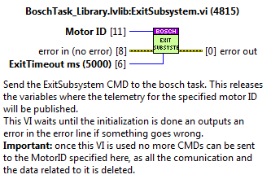
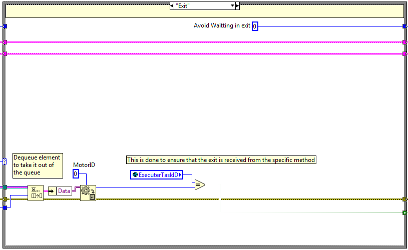
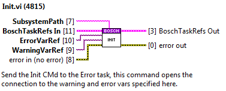

# Bosch task

This document describes the task used to communicate with the bosch system, from now on called Bosch task. This task
contains some public methods that must be used to send the required actions to the wanted bosch axis.

## Task public methods

Here the methods for the Bosch task are explained.

### InitSubsystem

Used to initialize the subsystem. Do it before starting the statechart, as part of the subsystem init actions. This
method will be the only one that will wait until the task answers to keep going. The task could answer an error or
nothing is everything goes fine.

Inputs:

- MotorID: the identifier of the motor. From this moment on, this ID will be the reference the data related to the
    subsystem/motor.
- FaultResponseQueueRef: the queue used to publish the error info when a fault is triggered from the task. Saved in
    the task related to the motor ID.
- TelemetryVarRefs: variables used to publish the telemetry of the system. Saved in the task related to the motor ID.
    If the variable is left empty nothing will be published for that topic.
  - TrackActive? var ref. Boolean type var.
  - Position var ref. DBL array type var.
  - Velocity var ref. DBL array type var.
  - Status var ref. String type var.
  - Status code var ref. I32 type var.
  - Torque var ref. DBL array type var.
  - Acceleration var ref. DBL array type var.
  - Positive limit: Limit.ctl
    - LimitVar2Publish Boolean type var.
    - Negate?
    - Bit
  - Negative limit: Limit.ctl
    - LimitVar2Publish Boolean type var.
    - Negate?
    - bit
- ResponseSubsystem: an input of the SubsystemGeneral.lvclass, is used to have the dynamic dispatch to the actual
    subsystem. Saved in the task related to the motor ID.
- Error In: transmits the error.
- InitTimeout ms: this is the timeout of the CMD, if this timeout is exceeded the subsystem did not start well and an
    error is triggered.
- Apply limits?: this is to tell the system that has to check for the limits of the subsystem or not.

### CloseTask

Method to close the app.

### ExitSubsystem

Method to exit a subsystem, this means closing the related refs.

Inputs:

- MotorID: the identifier of the motor. The reference to the data related to the subsystem/motor.
- ExitTimeout ms: this is the timeout of the CMD, if this timeout is exceeded the subsystem did not stop well and an
    error is triggered.

### Get Axis Info

Returns the position and speed. The values are taken from FGV_AxisInfo.

Inputs:

- MotorID: the identifier of the motor. The reference to the data related to the subsystem/motor.

### Move

Used for a Move CMD.

Inputs:

- MotorID: the identifier of the motor.
- Timeout ms: the timeout value for the CMD. If not wired the default value is -1, this means that timeout is not
    applied.
- Settings: MotionMoveAbsolute.ctl from MLPI
  - Position
  - Velocity
  - Acceleration
  - Deceleration
  - Jerk
- MuteResponse?: used to mute the answer to the statechart.

### MoveVelocity

Used for a MoveVelocity CMD.

Inputs:

- MotorID: the identifier of the motor.
- Settings: MotionMoveVelocity.ctl from MLPI
  - Velocity
  - Acceleration
  - Deceleration
  - Jerk
- MuteResponse?: used to mute the answer to the statechart.

### Power

Used for a Power CMD.

Inputs:

- MotorID: the identifier of the motor.
- Timeout ms: the timeout value for the CMD. If not wired the default value is -1, this means that timeout is not
    applied.
- Settings:
  - Power?: Tells the bosch task if has to turn on the axis or turn it off.
- MuteResponse?: used to mute the answer to the statechart.

### GetAxisStatus

Obtain the status of a specified Axis. Alberto thinks it's interesting to know the status if the axis is in fault or in parking.

Inputs

- MotorID: the identifier of the motor.

### Reset

Used for the Reset CMD.

Inputs:

- MotorID: the identifier of the motor.
- MuteResponse?: used to mute the answer to the statechart.

### Stop

Used for the Stop CMD.

Inputs:

- MotorID: the identifier of the motor.
- Timeout ms: the timeout value for the CMD. If not wired the default value is -1, this means that timeout is not
    applied.
- Parameters: StopSettings_TypeDef.ctl
  - Deceleration
  - Jerk
- MuteResponse?: used to mute the answer to the statechart.

### Track

Used for the Track CMD. The Bosch task does no longer have the tracking inside, the track CMD available just sends the
move continuous when received to the specified axis.

Inputs:

- MotorID: the identifier of the motor.
- Parameters:
  - Parameters: MoveContinuousAbsolute
    - Position
    - endVelocity
    - Velocity
    - Acceleration
    - Deceleration
    - Jerk

## Init and Exit Actions

### Init actions

Init actions of the bosch task:

- Create StopHelpingTask_Event Reference
- Obtain ErrorTaskQueue Reference
- Init the following FGVs:
  - FGV_AxisInfo
  - FGV_AxisInternalData
  - FGV_CMD_Receiver_Queue
  - FGV_CMD_ExecuterQueues
  - FGV_AxisMonitoringIDsInit needed queues and DVRs
- Init the error task
- Send Connect to the PLC

### Exit actions

Exit actions of the bosch task:

- Destroy StopHelpingTask_Event Reference
- Release ErrorTaskQueue Reference
- CleanUp the following FGVs:
  - FGV_AxisInfo
  - FGV_AxisInternalData
  - FGV_CMD_Receiver_Queue
  - FGV_CMD_ExecuterQueues
  - FGV_AxisMonitoringIDs

## Task loops

The bosch task has 5 tasks inside that manage different parts needed to operate the bosch system, each of them is
explained in the upcoming sections.

### CMD Receiver loop

This loop receives the CMDs from the API and executes the required actions for each CMD.

#### Task communication

The communication between the methods and the task is very simple and is done using a queue. This queue is initialized
at the init actions of the bosch task and released at the exit actions. The reference of the queue is saved to a FGV,
this FGV is called: "FGV_CMD_Receiver_Queue.vi" see figure below.

Each of the methods uses this queue to enqueue the next CMD and the CMD receiver loop dequeues the CMDs from the queue
at the beginning of each iteration, see figure below. If an error occurred at the previous iteration the ErrorHandling
state is executed and the last CMD will be dequeued in the next iteration, see figure below.

#### Methods

The methods of this loop are explained before as public methods of the bosch task.

#### Task states

Here the code for the different task states is explained.

##### Init Subsystem state

The code here is used when a new subsystem is added, the reference for this subsystem will be the MotorID. To initialize
this new system the following actions are executed:

1. Open the telemetry variable connections.
2. Save all the subsystem data inside an indexed FGV, "FGV_AxisInternalData", this FGV is private to ensure that data
    is only accessed from inside the library.
3. Save the initialized MLPI axis in another FGV, "FGV_AxisMonitoringIDs", this FGV is used at the monitoring loop, all
    the axis here are checked and the data related to it is published at the telemetry vars saved at the
    FGV_AxisInternalData.
4. Init the queue for this MotorID, this is done inside another FGV, "FGV_ExecuterQueues", this FGV saves the queue ref
    of each initialized motorID. This is done like this to ensure that each system has an independent queue and to
    enable simultaneous CMDs.
5. Finally, a response is sent to the calling method, the response is just the error line, this way the calling VI will
    know if everything was ok while initializing.

##### Exit Subsystem state

The code here is used when an existing subsystem is removed, the reference for this subsystem will be the MotorID. To
exit the existing system the following actions are executed:

1. Open the telemetry variable connections.
2. Save all the subsystem data inside an indexed FGV, "FGV_AxisInternalData", this FGV is private to ensure that data
    is only accessed from inside the library.
3. Save the initialized MLPI axis in another FGV, "FGV_AxisMonitoringIDs", this FGV is used at the monitoring loop, all
    the axis here are checked and the data related to it is published at the telemetry vars saved at the
    FGV_AxisInternalData.
4. Init the queue for this MotorID, this is done inside another FGV, "FGV_ExecuterQueues", this FGV saves the queue ref
    of each initialized motorID. This is done like this to ensure that each system has an independent queue and to
    enable simultaneous CMDs.
5. Finally, a response is sent to the calling method, the response is just the error line, this way the calling VI will
    know if everything was ok while initializing.

##### Close Task State

Stops the rest of the tasks executed in the bosch task, as well as this one, while closing any open connections.

##### Move State

The code is executed when the move method is used, here the MoveCMD private method from the Executer task is called.

##### Move Velocity State

The code is executed when the moveVelocity method is used, here the MoveVelocityCMD private method from the Executer
task is called.

##### Power State

The code is executed when the power method is used, here the PowerCMD private method from the Executer task is called.

##### Track State

The code is executed when the track method is used, here the TrackCMD private method from the Executer task is called.

##### Stop State

The code is executed when the stop method is used, here the StopCMD private method from the Executer task is called.

##### Reset State

The code is executed when the reset method is used, here the ResetCMD private method from the Executer task is called.

##### Get Axis Status State

The code is executed when the getAxisStatus method is used, here the CheckAxisStatus private method from the Executer
task is called.

##### Error Handling State

The code is executed when an error occurs at the error line, here the method from the error task send error is used.

### CMD Executer loop

This loop receives actions from the CMD receiver and communicates with the Bosch PLC. This loop includes the CMD
monitoring, this means that when one CMD takes time to execute a new state is enqueued after sending it to the Bosch
system to check the CMDs progress.

#### Task communication

The communication between the methods and the task is not as simple as the one for the CMDReceiver task. Here CMDs must
be executed in parallel for more than one MotorID, that's why there must be more than one queue. To solve this problem
and to avoid using lvclasses, that cause problems when deploying to a RT target, the adopted solution is an FGV with a
queue array, "FGV_CMD_ExecuterQueues" see Figure 30, each of the queue references of the array is linked to one MotorID.
This queue is initialized at the InitSubsystem state of the CMD Receiver task and released at the ExitSubsystem state.

Each of the methods uses the queue related to the specified MotorID to enqueue the next CMD and the CMD executer loop
gets all the queues of each iteration. This array is then indexed, and all the queue references are checked for
available CMDs.

At first the elements in the queue are not dequeued, first the element is previewed. After, at the selected state the
required actions are done. Some of the states need to check the connection status before executing the state, see figure
below, others do not need to do that and dequeue the queue at the beginning of the state, see figure below.

#### Methods

Here the methods of this task are explained. All the methods listed below are private methods that only can be accessed
from inside the library.

##### ConnectCMD

Connect task to the Bosch system.

##### DisconnectCMD

Disconnect task from the Bosch system.

##### ClearErrorAxisCMD

Reset error from the specified MotorID.

##### PowerCMD

Send power on/off to the specified MotorID.

##### StopCMD

send stop to the specified MotorID.

##### MoveCMD

Send move absolute to the specified MotorID.

##### MoveVelocityCMD

Send move velocity to the specified MotorID.

##### Track

Send move continuous to the specified MotorID.

##### CheckAxisCMD_AtOppositeEnd

Checks the specified motionHandle to trigger the statechart when finished or when an error occurs.

##### CheckAxisStatus

Checks the status of the specified MotorID and answers at the specified AxisStatusQueue.

##### SendDoneCMD

Sends the done trigger to the statechart linked to the specified motorID.

##### SendFaultCMD

Sends the fault trigger to the statechart linked to the specified motorID. Sends the info of the fault to the statechart
using the queue ref saved at the FGV_AxisInternalData.

##### ClearSystemErrorCMD

This is a task specific method and is used to clear the general errors of the bosch system.

##### ExitCMD

This is a task specific method and is used to close the task.

#### Task states

Here the code for the different task states is explained.

##### Init

Perform the init actions of the task. [Nothing so far.]{.mark}

##### Idle

Empty state just to do nothing and wait until another CMD is available.

##### Connect

The code is executed when the connect method is used, here the Connection to the Bosch system is done, the connection
handle is saved in a FGV ("FGV_BoschConnection") to access it from the axis monitoring loop.

##### ClearSystemError

The code is executed when the clearSystemError method is used, here the function clear error from the Bosch system is
done.

##### Disconnect

The code is executed when the disconnect method is used, here the disconnection from the Bosch system is done, the
closed connection handle is saved in a FGV ("FGV_BoschConnection") to access it from the axis monitoring loop.

##### ClearError Axis

The code is executed when the ClearErrorAxis method is used, here the errors from the axis linked to the specified
MotorID are cleared. When done a done response is sent to the statechart related to the MotorID, unless the response is
muted.

##### Power Axis

The code is executed when the power method is used, here the axis linked to the specified MotorID is powered on or off
depending on the specified boolean value. To know when done a new state is enqueued at the opposite end of the queue
CheckAxis state, this state checks if the CMD is done, if it has an error and if it was timed out.

##### Stop Axis

The code is executed when the stop method is used, here the axis linked to the specified MotorID is stopped using the
deceleration and jerk specified as settings. To know when done a new state is enqueued at the opposite end of the queue
Check Axis state, this state checks if the CMD is done, if it has an error and if it was timed out.

##### Move Axis

The code is executed when the move method is used, here the axis linked to the specified MotorID is moved to the
specified absolute position using the acceleration, deceleration and jerk specified as settings. To know when done a new
state is enqueued at the opposite end of the queue Check Axis state, this state checks if the CMD is done, if it has an
error and if it was timed out.

##### MoveVelocity Axis

The code is executed when the moveVelocity method is used, here the axis linked to the specified MotorID is moved at the
specified velocity using the acceleration, deceleration and jerk specified as settings. To know if an error occurs
during the move a new state is enqueued at the opposite end of the queue Check Axis state, this state checks if the CMD
is done, if it has an error and if it was timed out, but for this specific CMD the only important check is the error
check, as a move velocity can´t have a done or a timeout.

##### Track Axis

The code is executed when the track method is used, here the axis linked to the specified MotorID is moved to the
specified position using the endSpeed, acceleration, deceleration and jerk specified as settings. To know if an error
occurs during the move a new state is enqueued at the opposite end of the queue Check Axis state, this state checks if
the CMD is done, if it has an error and if it was timed out, but for this specific CMD the only important check is the
error check, as a track can´t have a done or a timeout.

##### CheckAxisCMD

This state checks the CMD status, this means that it checks if the CMD is done, if it has an error and if it was timed
out.

##### Exit

This case is used to exit the task, here is checked that the calling method is the task exclusive MotorID that is the 0.

##### Send Done

The code is executed when the send done method is used, here a done trigger is sent to the statechart linked to the
specified MotorID.

##### Send Fault

The code is executed when the send fault method is used, here a fault trigger is sent to the statechart and the
faultResponseQueue is updated with the fault information linked to the specified MotorID.

##### Check Axis Status

The code is executed when the check axis status method is used, here the status of the axis linked to the specified
MotorID is checked and updated in the response queue called AxisStatusQueue re, this queue is dequeued at the calling
public method `GetAxisStatus`.

### Axis Monitoring task

This task is divided in two loops, one for the axis values (position, velocity, acceleration, torque and status) and the
other loop is used to read the limits status (positive and negative limit switch). This is done like this, due to the delay
when reading the limits.

#### Axis values monitoring loop

This loop publishes the telemetry given by the GetAxisValues function from the MLPI library, this function returns:
actual position, actual velocity, actual acceleration, actual torque, state, state extended, diagnosis number and
condition. From all this data the wanted one is only published, to do so at the initSubsystem the wanted variables must
be specified, if no variable is specified that value is not published.

The telemetry vars published here are opened at the InitSubsystem state of the CMD Receiver and closed at the
ExitSubsystem state.

#### Task communication

This task has no communication, this task is checking if the connection is established to the bosch system and if done
the initialized subsystems variables are published constantly.

The only communication is the stop event launched from the CMD receiver Close task state.

##### Publishing vars

Here the variables that the system can publish are shown.

- Position var ref. DBL array type var.
- Velocity var ref. DBL array type var.
- Status var ref. String type var.
- Status code var ref. I32 type var.
- Torque var ref. DBL array type var.
- Acceleration var ref. DBL array type var.

#### Limits monitoring loop

This loop publishes the status of each axis limits, the values for are given by the ReadDataULong function from the MLPI
library, this function returns the value of the specified parameter. This code is executed for all axis that have the
apply limit control to true when initialized.

The telemetry vars published here are opened at the InitSubsystem state of the CMD Receiver and closed at the
ExitSubsystem state.

### Task communication

This task has no communication, this task is checking if the connection is established to the bosch system and if done
the initialized subsystems variables are published constantly.

The only communication is the stop event launched from the CMD receiver Close task state.

#### Publishing vars

Here the variables that the system can publish are shown.

- Positive Limit var ref. Boolean type var.
- Negative Limit var ref. Boolean type var.

### Watchdog

This task monitors the connection between the PXI and the Bosch PLC, if the connection fails several times an alarm is
triggered. Additionally, this task publishes the status of the connection and the bosch controller state
(possible controller estates are: BB, P0, P1, P2 and P3).

#### Task communication

This task has no communication, this task is checking if the connection is working between the bosch system and the PXI,
if okay nothing is done, but if not working a warning is sent.

The only communication is the stop event launched from the CMD receiver Close task state.

### Error task

This task publishes the software errors and warnings related to the Bosch task.

#### Task communication

This task has a single queue and the methods use it to publish the available states, these methods are private methods.
The queue reference is created at the InitActions and released at the ExitActions of the bosch task. The reference is
saved to a cluster, "BoschTaskRefs", as it has no need to be used out of the library main VI.

#### Methods

The methods available for this task are described in the upcoming sections.

##### Init

This method enqueues the init state of the error task.

##### Exit

This method enqueues the exit state of the error task.

##### Send Error

This method enqueues the send error state of the error task and sends the error cluster wired to the Error2Send as CMD
data.

##### Send Warning

This method enqueues the send warning state of the error task and sends the Waring number, warning name and description
as CMD data.

