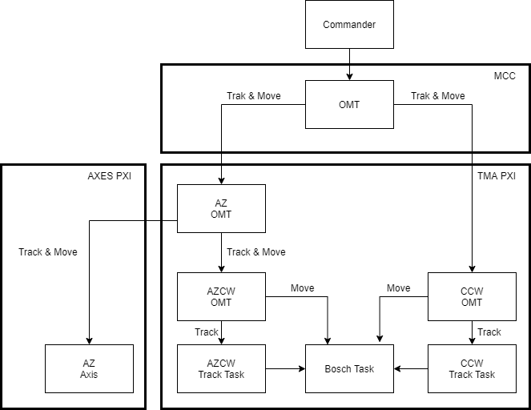

# Azimuth And Camera Cable Wrap

In the TMA there are 2 motorized cable wraps, one for azimuth and other for camera rotator.
The cable wrap rotates the cables to ensure that a moving part don’t breaks cables. So, the cable wrap must follow the
subsystem that moves. For azimuth cable wrap the subsystem to follow is azimuth, while for camera cable wrap is the
camera rotator.

For each subsystem Azimuth Cable wrap and Camera Cable Wrap different task will be implemented but for both the
developed statechart will be the same. There will be some differences events to manage differences in both subsystems.
