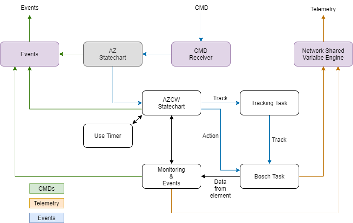
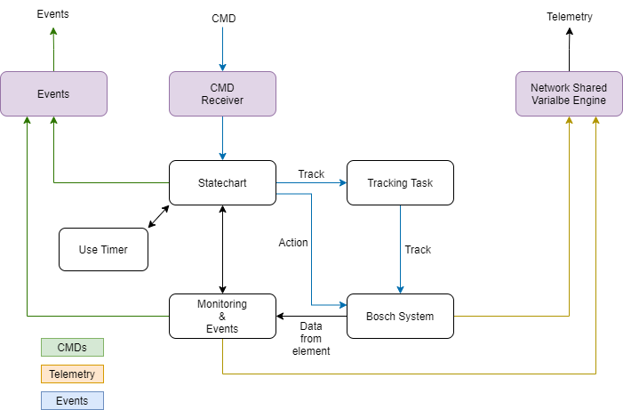

## Software Structure

The structure is slightly different for Azimuth or Camera cable wrap, since the first one is a subordinated subsystem,
receives commands from Azimuth subsystem, and the second one is independent subsystem.

### Azimuth Cable Wrap

This subsystem is not an independent subsystem, it belongs to Azimuth axis. So, since AZCW is commanded by azimuth axis
directly. There is ability to command the AZCW directly, but command is sent to azimuth subsystem which checks that all
is OK to proceed with the command and then azimuth state machine sends the command to AZCW state machine.

The state machine is the logic of the subsystem. This state machine is programmed using the Tekniker´s statechart
framework and executed in the statechart task. The CCW is an instance of Cable Wrap OMT statechart. The statechart will
be managed by triggers that come from command reception task and from event task. The CCW has two Bosch motors, so the
subsystem must command this motor trough the [Bosch task](#bosch-drives-management), sending commands to it.
There is only one Bosch motor working, and a failure in this motor will generate and automatic motor change.

There is a task for events, the **monitoring and event task**. It will execute evaluation of events with some of the
process values. This task also has some monitoring characteristics, but motor related data monitoring and publishing is
performed by the Bosch task itself.

### Camera Cable Wrap

This subsystem is an independent subsystem. So that, it gets command directly from the commander. The reception of
commands is managed by the **command receiver**, that get commands and retrieves them to the state machine.

The state machine is the logic of the subsystem. This state machine is programmed using statechart module and executed
in the **statechart task**. The CCW is an instance of Cable Wrap OMT statechart. The statechart will be managed by
triggers that come from command reception task and from event task. The CCW has two Bosch motors, so the subsystem must
command this motor trough the Bosch task, sending commands to it. There is only one Bosch motor working, and a failure
in this motor will generate and automatic motor change.
There is a task for events, the monitoring and event task. It will execute evaluation of events with some of the process
values. This task also has some monitoring characteristics, but motor related data monitoring and publishing is performed
by the Bosch task itself.

This subsystem is programmed as an independent subsystem from any other subsystem, and the only dependencies is with
camera rotator and main cabinet temperature controller. Camera rotator interference is manage by safety interlock
managed by safety subsystem, so this is implemented in the monitoring and events task. The main cabinet temperature
controller will also generate and event in case of malfunction.
