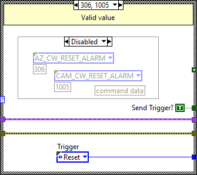

## CMD Reception

The command reception is managed by the Command Receiver, but this subsystem must be subscribed in the command receiver task in order to receive commands. Also this subsystems must define the class to be interface with them.
The CCW always must be subscribed to the command receiver. The AZCW is not subscribed to the command receiver, since it receive the commands through the azimuth axis, but there is the ability to subscribe to command receiver for standalone testing of the AZCW.

TODO: Write something about subscription code

### Cable Wrap subsystem definition class
The subsystem definition object is an object of SubsystemCW class. This class is created for this subsystem specifically and overrides the parent class SubsystemGeneral class.
The methods that overrides parent methods are described in next sections.

#### SendAlarmTrigger

This method just sends the trigger “Fault” to the statechart instance of actual object (element). The error in the input has no effect on this method and just propagates to the output.

#### SendWarningTrigger
This method just sends the trigger “Warning” to the statechart instance of actual object (element). The error in the input has no effect on this method and just propagates to the output.

#### SendDoneTrigger
This method sends the trigger “Done” to the statechart instance of actual object (element). This done is for receiving done triggers for Bosch Task. The error in the input has no effect on this method and just propagates to the output.

#### SendTriggerToOMT
This method will select the appropriate trigger to the statechart, depending on the received command. This selection will be done using two private methods, SelectOMTTrigger and GenerateOMTTrigger, that will be explained in next sections

#### SelectOMTTrigger
This method selects the balancing statechart trigger depending on the command received.

If the command number is 0 it will do nothing, because it will be considered as communication error.
If the command number is not listed in the next tables it will ask command receiver task to send a no ack and will not send any trigger to statechart.

The next table are the commands for the camera cable wrap

|Received Command|Command Number|StateChart Trigger|
|------|-------|-----|
|CAM_CW_POWER|1001|Power|
|CAM_CW_STOP|1002|Stop|
|CAM_CW_MOVE|1003|Move|
|CAM_CW_TRACK_CAMERA|1004|Track|
|CAM_CW_RESET_ALARM|1005|Reset|
|CAM_CW_DRIVE_ENABLE|1006|EnableDrive|
|CAM_CW_DRIVE_RESET|1007|ResetDrive|
|CAM_CW_MOVE_VELOCITY|1008|MoveVelocity|
|CAM_CW_ENABLE_TRACK_CAMERA|1009|EnableTrack|

The next table are the commands for the azimuth cable wrap

|Received Command|Command Number|StateChart Trigger|
|------|-------|-----|
|AZ_CW_POWER|301|Power|
|AZ_CW_STOP|302|Stop|
|AZ_CW_MOVE|303|Move|
|AZ_CW_TRACK_AZIMUTH|305|Track|
|AZ_CW_RESET_ALARM|306|Reset|
|AZ_CW_DRIVE_ENABLE|308|EnableDrive|
|AZ_CW_DRIVE_RESET|307|ResetDrive|
|AZ_CW_MOVE_VELOCITY|304|MoveVelocity|
|AZ_CW_ENABLE_TRACK_CAMERA|309|EnableTrack|

#### GenerateOMTTrigger
The selected trigger by SelectOMTTrigger will be generated in the cable wrap state machine instance.

