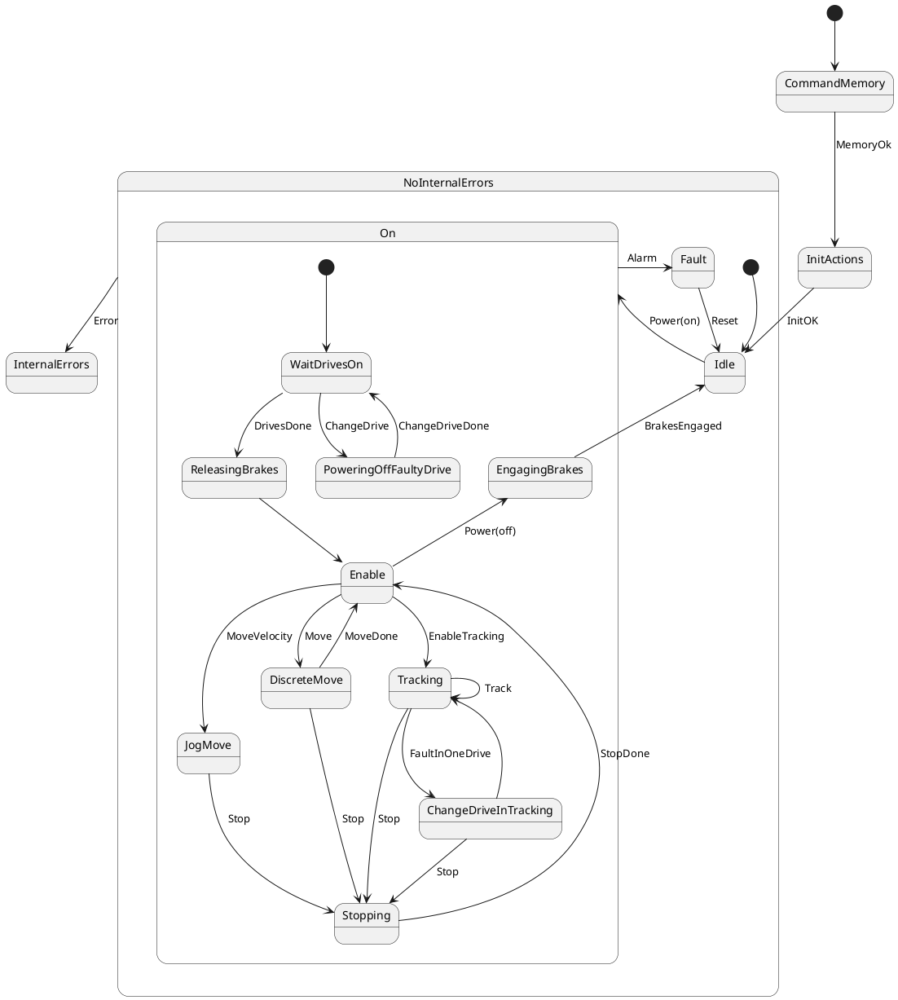

## State Machine

The behavior of the system is managed by the state machine. The state machine for cable wraps is shown in next diagram

```plantuml

@startuml

state NoInternalErrors {
  
  state Idle
  state On {
    state WaitDrivesOn
    state ReleasingBrakes
    state Enable
    State PoweringOffFaultyDrive
    state DiscreteMove
    state Stopping
    state JogMove
    state Tracking
    state ChangeDriveInTracking{
    }
    state EngagingBrakes
    [*] --> WaitDrivesOn
    WaitDrivesOn --> ReleasingBrakes : DrivesDone
    ReleasingBrakes --> Enable
    Enable --> DiscreteMove : Move
    DiscreteMove --> Enable : MoveDone
    DiscreteMove --> Stopping : Stop
    Enable --> JogMove : MoveVelocity
    JogMove --> Stopping : Stop
    Enable --> Tracking : EnableTracking
    Tracking --> Tracking : Track
    Tracking --> Stopping : Stop
    Tracking --> ChangeDriveInTracking : FaultInOneDrive
    ChangeDriveInTracking --> Tracking
    ChangeDriveInTracking --> Stopping : Stop
    Stopping --> Enable : StopDone
    WaitDrivesOn --> PoweringOffFaultyDrive : ChangeDrive
    PoweringOffFaultyDrive --> WaitDrivesOn : ChangeDriveDone
    Enable -up-> EngagingBrakes : Power(off)
  }
  state Fault
  
  [*] --> Idle
  Idle -down-> On : Power(on)
  On -right-> Fault : Alarm
  Fault --> Idle : Reset
  EngagingBrakes --> Idle : BrakesEngaged

}

state InternalErrors {
}

[*] --> CommandMemory
CommandMemory --> InitActions : MemoryOk
InitActions --> Idle : InitOK
NoInternalErrors --> InternalErrors : Error

@enduml
```
