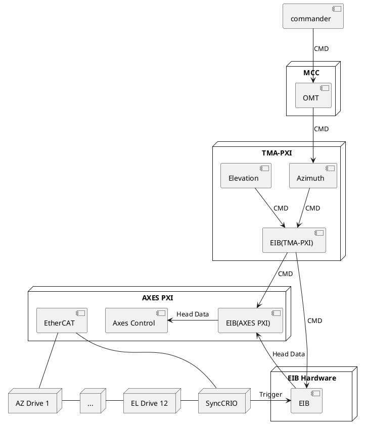
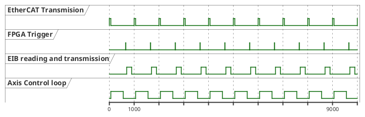

# EIB

The EIB is a hardware that enables the reading of the encoder positions. The hardware converts the analog data get from the heads into a counting data. The hardware has 8 inputs.

The software implemented is to manage the EIB and to read and convert data gotten from the EIB to telescope angles. The EIB is a subordinated subsystem that could not be accessed directly from the commander. The commands to the EIB go through Azimuth subsystem that will check that the command is allowed. To command the EIB from the commander, Azimuth and Elevation must be in idle state, otherwise the command will be rejected by Azimuth.

By the other way, both azimuth and elevation can manage the EIB, so both subsystems send commands to the EIB subsystem.

The EIB code is divided in two main parts. The first part runs in the TMA-PXI and implements the state machine. The state machine configures the hardware and the other software part that runs in the AXES PXI. The AXES PXI part gets the head data and process it to serve it to the Axes control.

There is another code that is running in the FPGA of a cRIO. This hardware is used to synchronize the encoder with control loop. The cRIO is an EtherCAT slave, that has the info of the EtherCAT loop timing, so cRIO can send a hardwired trigger to the EIB. This trigger makes that the position data arrives to the AXES PXI before the axis control loop use it to process de control algorithm, but not to early to avoid delays in the control loop.

The next diagram shows an example of EtherCAT data transmission, the axis control loop timing and where is the FPGA triggered to ensure that EIB data arrives to PXI just before the next control iteration is started.

