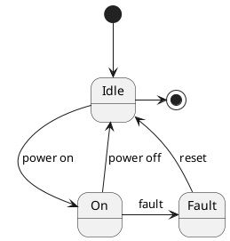

## State Machine

The state machine is very simple in this case. This is in this way because the this system is really a command executer for both axes and the commands could be independent of the state of the system. For example, the reference command is independent for both axis an a reference in one axis could be done even if the other axis is not "powered on" (receiving data for one axis does not mean that the axis ready to work or powered on). 

