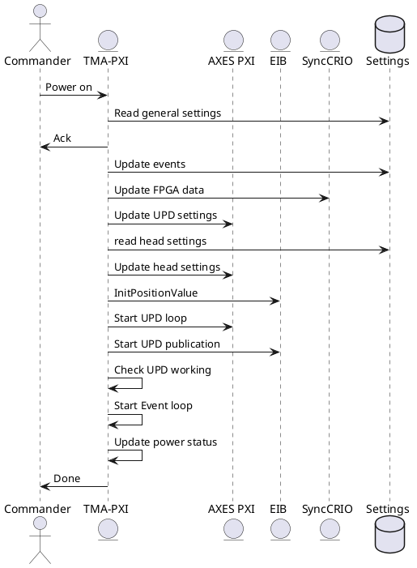
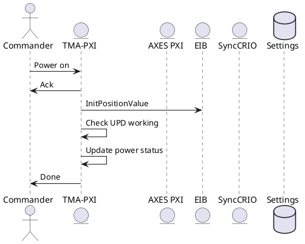
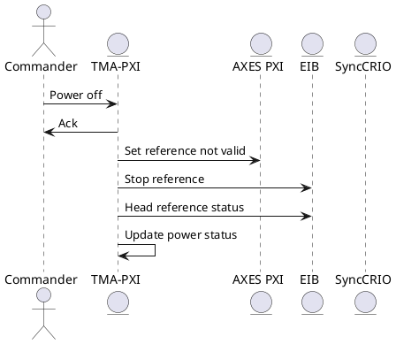
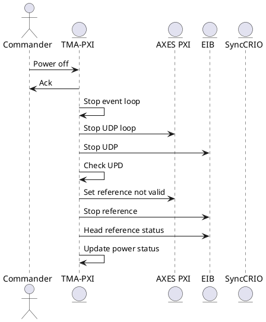
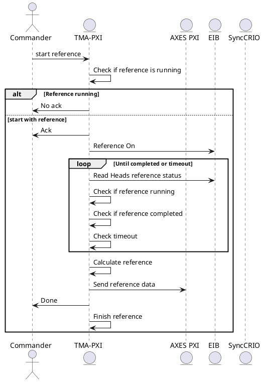
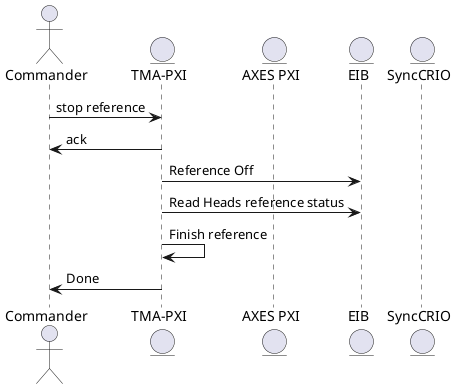
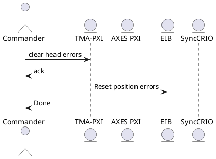
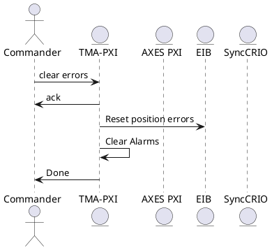
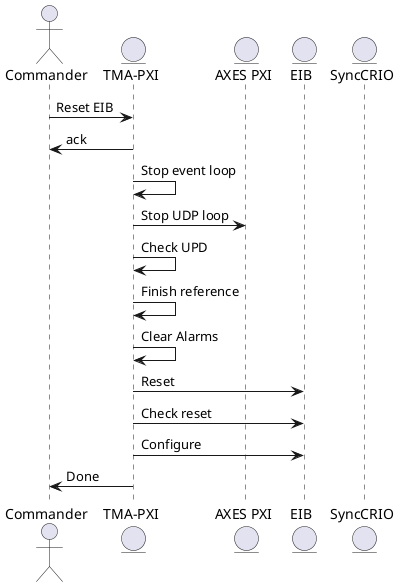

## Command Sequences

### Power On

Since the UPD for the EIB is command for Azimuth and Elevation heads, the power on command sequence depends if the EIB is already powered on or not. For the first power on, there are more actions to do, because the EIB starts sending data. In the second power on the EIb is already on, and just a configuration of the second axis heads is carried on. 

For the firs power the sequence is shown in next figure

For the second power, the EIB is already sending data via UDP, so the configuration of the FPGA and EIB has no sense.

### Power off

Since the UDP is common for azimuth and elevation heads, the EIB will be powered off only if both axis are powered off. This is, if a power off is received for elevation and azimuth is still on, the EIB will not switched off and data will be received for all heads.

If power off is not required, because there is another axis still powered on

If the power of the EIB is possible, then the sequence is shown in next diagram.

### Start Reference

The reference search is the procedure to get the absolute position. The heads that fulfil this procedure without errors have a valid absolute position. The reference procedure is started in the home sequence of an axis.

### Stop Reference

### Clear Heads Errors

### Clear Errors

### Reboot EIB

This command reboots the EIB hardware. **Do no execute this command if it is not necessary**. **To execute this command Azimuth and elevation must be powered off**

