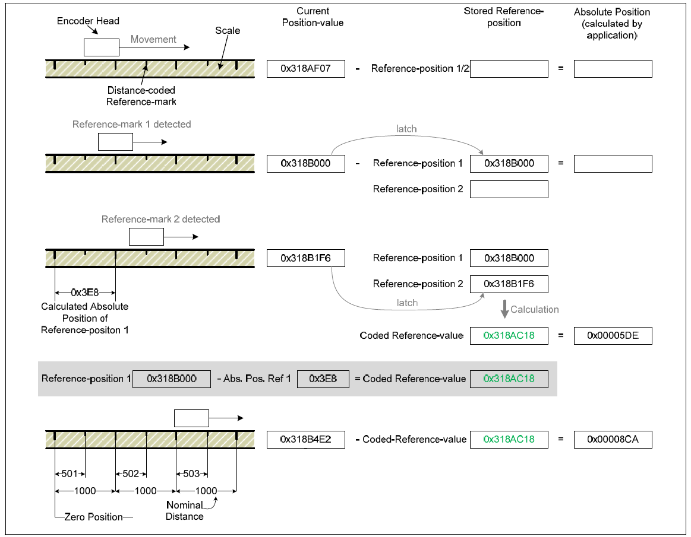

## Hardware working

The basic encoder elements are:

* a tape
* a scanning head
* the EIB

In the telescope, each axis has its own combination of these elements.

Azimuth has a tape located in the out diameter of the pier in level 8. Then, there are 4 scanning heads reading from that tape.

Elevation has two tapes, one in each cradle, and 2 scanning heads reading form each tape.

All 8 scanning heads are wired to the same EIB, there is just one EIB in the TMA. The EIB has 4 slots with two inputs
(axis) each. To the axis 1 of each slot an azimuth head is connected while the elevation heads are connected to the axis
two of each slot.

### Tape

The tape is a graduated scale. This graduated scale has a mark every 40um.

The Azimuth tape is a single tape for a whole round, so it has a junction point. The zero position of the tape is located in
the junction point, and the positive sense is counterclockwise looking form above.

The elevation tapes are finite angle tapes, covering the 0 to 90 degrees range of the axis, so there is no junction point.
The zero position is located in opposite extremes for both tapes. So, when one tape is in zero the other is in the maximum value.

### Scanning HEADS

The are 4 scanning head for each axis. The scanning heads read the position of the scanning head from the a tape.

### EIB

The EIB is the hardware that manages the readings from the heads. It also manages the communication with the higher level systems (PXIs).

The EIB hardware is configured to send data via UPD to the AXES PXI. For each scanning head the following data can be obtained:

* Current position
* Speed
* Timestamp
* Reference data
* Analog values. The EIB allows to get the analog value of the analog to digital converters. This data could be useful
  for analyzing the status of the head. **At this moment this value is not available in the implemented software**

#### Current Position

The current position, is the position initialized to 0 when the EIB axis is powered on. When powering the EIB for one
telescope axis (AZ/EL), the position of the heads of the axis are initialized to zero (see [Power on](05%20Commad%20sequences..md#Power-On)
command). So, this current position is the relative position for each telescope axis powered on.
**This position is the position used by the control system to control the axis**, so the axis starts with a relative
position of zero (the position will be later compensated by the axis control/state machine with inclinometer or ACW
position data to start with a roughly valid position instead of zero).

The position is composed by a 32 bit number that counts the lines in the scale and 16 bits for the interpolated position
inside two lines.

#### Speed

This is the speed calculated by the EIB for each head.

The speed is a 48 bit value where 1 is equivalent to 40um/2^22us.

#### Timestamp

This is the EIB timestamp when the position data packed is triggered. The timestamp is not synchronized to PXI timestamp,
but it can be used to check data or improve speed calculation.

The value is a counter of 10MHz clock that starts with each EIB hardware power on.

#### Reference Data

The encoder is an absolute encoder, but the encoder needs to find the reference before the data becomes absolute. The
used tapes have distance-coded reference marks.

Reference marks are located at fixed distances (nominal increment in signal periods) along the entire measuring range.
Between two of these reference marks, there is a third whose distance from the other two varies in such a way that each
distance is a multiple of the grating period and occurs only once over the entire measuring range (see figure below).
The reference for generating absolute position values from the counter values is obtained through the distance of two
traversed (adjacent) reference marks.

For this purpose, the period counter value is saved twice, once each time a reference mark is traversed. The coded
reference value is generated from the distance of the (adjacent) reference marks, and in doing so the reference for
generating absolute position values is also created.

The coded reference value thus corresponds to the offset between the absolute position value and the generated (incremental) position value.

The figure below shows the general process of determining a reference position. The displayed values are only given as an example.

The reference mark data packed is equivalent to position data packet, but the 16 bits corresponding to interpolated value is always 0.
