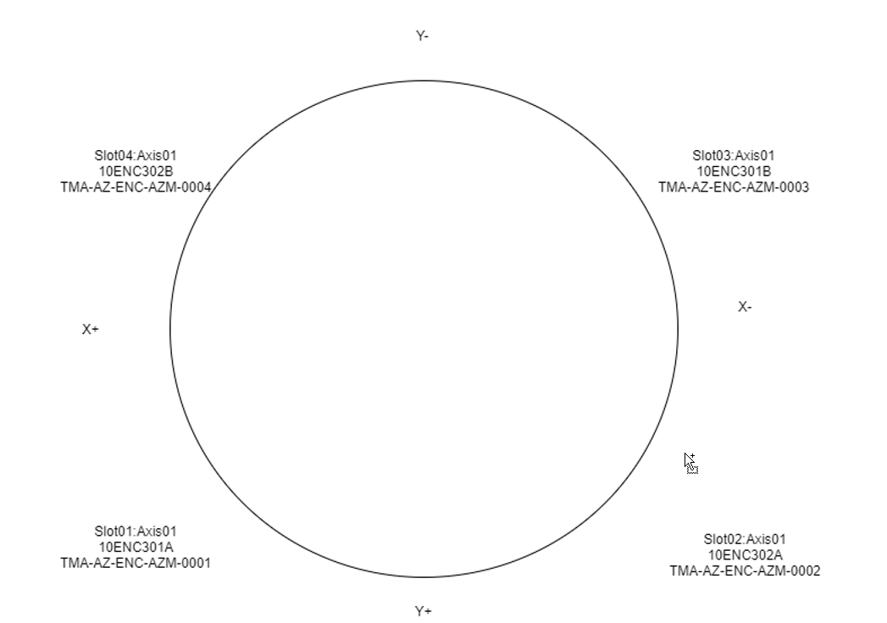
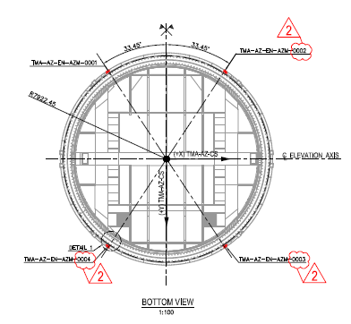

## Reference Calculation

As shown in [Reference Data](06%20Hardware%20working.md#Reference-Data), the absolute position is calculated using the current position (relative position) and reference data.

```
absolutePosition = currentPosition - referenceData
```
With this formula the absolute position of each head is obtained. Each head is located in a different position, so with this formula the absolute position of each head is different.

For instance the azimuth heads are distributed around the encoder tape according to the next scheme



As can be seen in next figure the distance for different head is not constant (the name of the heads is not correct, but angle distances are OK)



Let's assume that the head1 reads 0 deg as absolute position, so the head2 will read -115.6 deg. This difference should maintain constant along all the measurement range of the encoder, this is, if the head1 is located in 150 deg the head2 should read 34.4 deg. But again, as each head read its own position and this position has a very different location for each, any error in the road or any deflection of the telescope could affect the difference between heads.

The values obtained directly by heads are not valid for control the axis. To control the axis a unique value is needed. To achieve this, a constant value for each head is added to the obtained reference value. In the azimuth case, the value added is about the value of difference of each head with the head1 in encoder internal units. This way all the heads are referenced to head1 position. With this operation, the zero position of the telescope is when the head 1 is in the beginning of the tape (in azimuth, in the tape junction). This position is not the zero of the telescope, so a new offset is added to this correction values. The procedure for elevation is very similar, but one of the tapes measures in the opposite sense.

So the absolute position, in rad, for each head is calculated using the next formula.

```
absolutePosition = (currentPosition - referenceData) * headGain + headOffset
 
 where

 headGain = relation between internal units and rad
 headOffset = the offset that makes the head to measure the same as the selected master head + the offset that makes the master head read 0 at telescope zero position
 ```

 In the azimuth case, there is a particularity. After doing the mathematics to get the absolute position, the position obtained could be 360deg away from the actual position (it is the same position but in another turn). So, there is implemented and algorithm to validate the calculation. The algorithm also try to solve the 360deg issue, but in case the value is out of range (compared with the azimuth cable wrap position) the head will be flagged as not referenced. As it is explained in [Axis Control](../10%20Subsystems%20Azimuth%20and%20Elevacion/20%20Axis%20Control.md/#position-control-algorithm), if the head is not a valid reference flag it will not be used for calculations.
