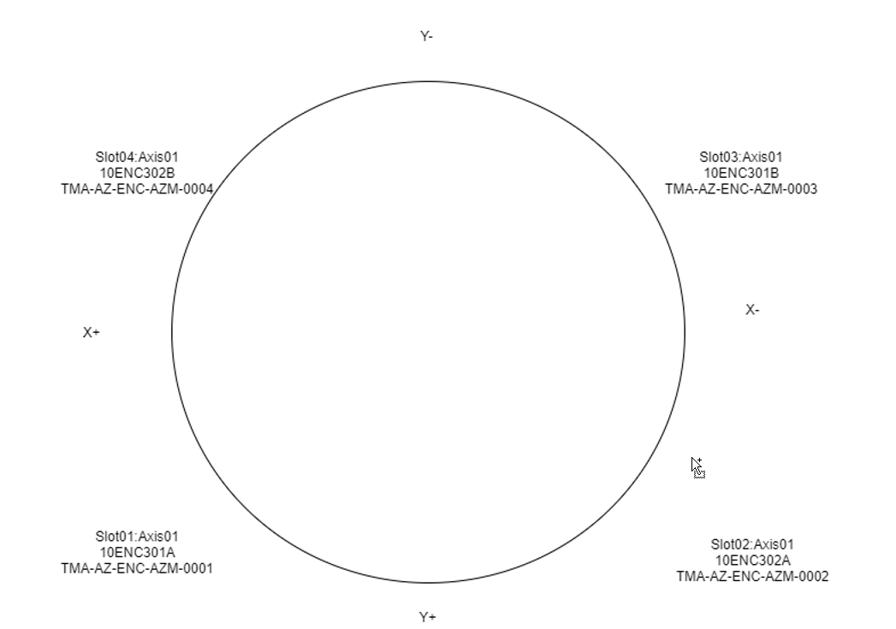
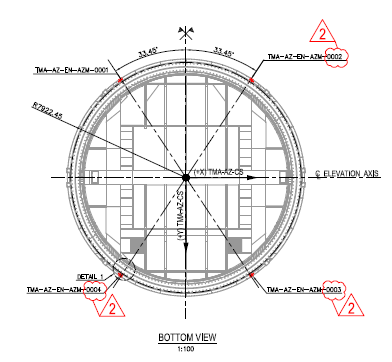

## Reference Calculation

As shown in [Reference Data](06%20Hardware%20working.md#Reference-Data), the absolute position is calculated using the
current position (relative position) and reference data.

```math
absolutePosition = currentPosition - referenceData
```

With this formula the absolute position of each head is obtained. Each head is located in a different position in the
telescope, so using this formula the absolute position for each head is different.

The azimuth heads are distributed around the encoder tape according to the next scheme:



As can be seen in the next figure, the distance between heads is not uniform (in the figure the names are not correct,
but angle distances are OK)



For elevation a different head distribution is used, but the approach is the same.

Calculation example: Assuming an absolute position of 0 for head1, head2 will read -115.6 deg.
This difference should maintain constant along all the measurement range of the encoder.
So, if the telescope is moved such us the head1 is located in 150 deg the head2 should read 34.4 deg (150 - 115.6 deg).
But, what actually happens is that for a position of 150 for head1 the head2 reads something like 34 deg. This is like this,
because each head read its own position and the heads are far apart, so any errors due to deformation, construction
tolerances, etc. are reflected as position difference.

The values obtained directly by heads are not valid for controlling the axis. To control the axis a unique value is needed.
To achieve this, a constant value for each head is added. In the azimuth case, the value added is about the value of
difference of each head with the head1. This way, all the heads are referenced to head1 position. With this solution,
the zero position of the telescope is when the head1 is at the beginning of the tape
(in azimuth, in the tape junction). This position, is not the zero of the telescope, so a new offset is added to this
correction values in order to manage the zero telescope to desired position. The procedure for elevation is very similar.

So the absolute position, in rad, for each head is calculated using the next formula.

```math
absolutePosition = (currentPosition - referenceData) * headGain + headOffset
```

where:

- headGain = relation between internal units and rad for each head
- headOffset = headToMasterHeadOffset + masterHeadToTelescopeOffset
- headToMasterHeadOffset = the offset that makes the head to measure the same as the selected master head
- masterHeadToTelescopeOffset = the offset that makes the master head read 0 at telescope zero position

In the azimuth case, there is a particularity. After doing the mathematics to get the absolute position, the position
obtained could be 360deg away from the actual position (it is the same position but in another turn).
So, an algorithm to validate the calculation is implemented. The algorithm also tries to solve the 360deg difference issue,
but in case the value is out of range (compared with the azimuth cable wrap position) the head will be flagged as not valid reference.
As it is explained in [Axis Control](../10%20Subsystems%20Azimuth%20and%20Elevacion/20%20Axis%20Control.md/#position-control-algorithm),
if the head has not a valid reference flag it will not be used for calculations.

>**NOTE**
>
>The fixed zero telescope positions at the telescope startup for both axis were done as follows:
>
>- Azimuth. The Azimuth Cable Wrap was in its center position. This was done visually, when all the pipes of the Azimuth
>  Cable Wrap were straight.
>- Elevation. The locking pins went all the way into the locked position with elevation at horizon. This was not exactly possible
>  because the telescope was moved manually, so it was accepted as valid when one of the locking pins was able to move
>  to the lock position.
