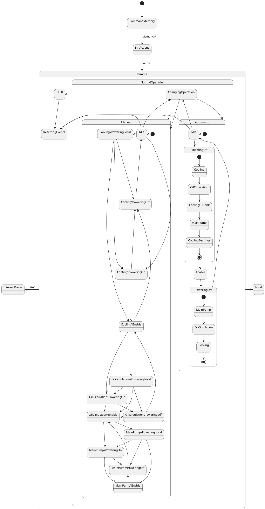

## State Machine

The behavior of the system is managed by the state machine. The state machine is represented in the diagram below.

TODO: missing bypass doc

The two triggers that come out of the on state and go back to it are static reactions inside the on state to "enable" the alarms after certain time.
