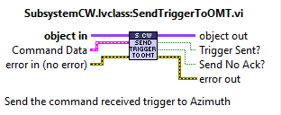
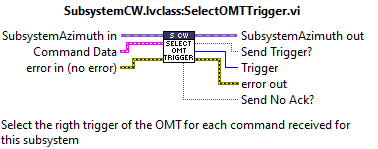
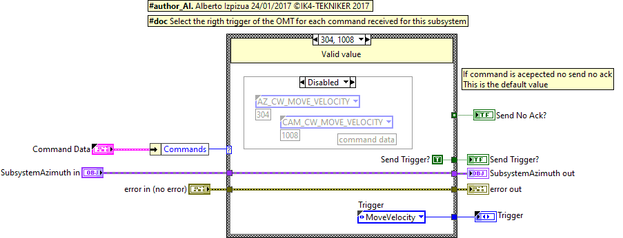
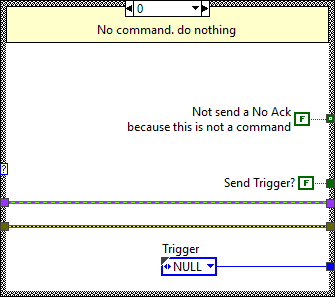
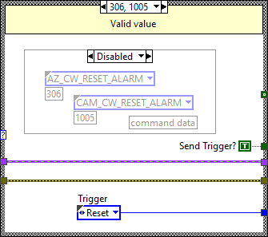
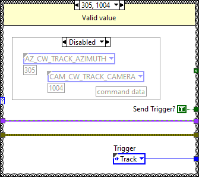
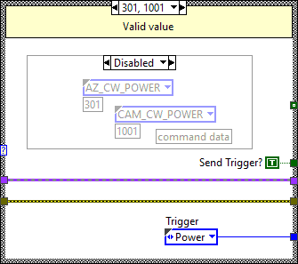
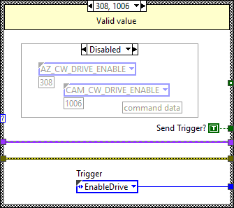
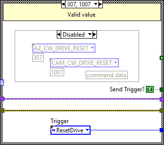
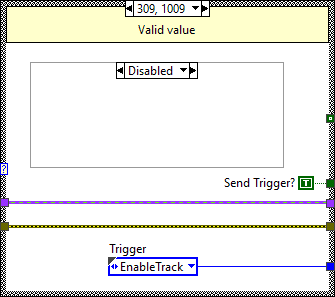

## CMD Reception

The command reception is managed by the Command Receiver, but this subsystem must be subscribed in the command receiver
task in order to receive commands. Also this subsystems must define the class to be interface with it.

TODO: Review info

TODO: Write something about subscription code

### Main Axes definition class

TODO: change text from this line on

The subsystem definition object is an object of SubsystemCW class. This class is created for this subsystem specifically
and overrides the parent class SubsystemGeneral class.
The methods that overrides parent methods are described in next sections.

#### SendAlarmTrigger

This method just sends the trigger “Fault” to the statechart instance of actual object (element). The error in the input
has no effect on this method and just propagates to the output.

#### SendWarningTrigger

This method just sends the trigger “Warning” to the statechart instance of actual object (element). The error in the
input has no effect on this method and just propagates to the output.

#### SendDoneTrigger

This method sends the trigger “Done” to the statechart instance of actual object (element). This done is for receiving
done triggers for Bosch Task. The error in the input has no effect on this method and just propagates to the output.

#### GetInstances

This method allows the system to convert the ID in parameters to the appropriate element ID. The method looks for a
negative number and in it will put in the output an array with four indexes that should be valid for this subsystem.
If the ID is positive it will only just put in the output

#### SendTriggerToOMT

This method will select the appropriate trigger to the statechart, depending on the received command. This selection
will be done using two private methods, SelectOMTTrigger and GenerateOMTTrigger, that will be explained in next sections

#### SelectOMTTrigger

This method selects the balancing statechart trigger depending on the command received.

If the command number is 0 it will do nothing, because it will be considered as communication error.
If the command number is not listed in the next tables it will ask command receiver task to send a no ack and will not
send any trigger to statechart.

The next table are the commands for the camera cable wrap (commands are detailed in [commands](/01%20Commands.md#Commands))

|Received Command|Command Number|StateChart Trigger|
|------|-------|-----|-----|
|CAM_CW_POWER|1001|Power|
|CAM_CW_STOP|1002|Stop||
|CAM_CW_MOVE|1003|Move|Position(DBL), Velocity (DBL), |
|CAM_CW_TRACK_CAMERA|1004|Track||
|CAM_CW_RESET_ALARM|1005|Reset||
|CAM_CW_DRIVE_ENABLE|1006|EnableDrive||
|CAM_CW_DRIVE_RESET|1007|ResetDrive||
|CAM_CW_MOVE_VELOCITY|1008|MoveVelocity||
|CAM_CW_ENABLE_TRACK_CAMERA|1009|EnableTrack||

The next table are the commands for the azimuth cable wrap

|Received Command|Command Number|StateChart Trigger|
|------|-------|-----|
|AZ_CW_POWER|301|Power|
|AZ_CW_STOP|302|Stop|
|AZ_CW_MOVE|303|Move|
|AZ_CW_TRACK_AZIMUTH|305|Track|
|AZ_CW_RESET_ALARM|306|Reset|
|AZ_CW_DRIVE_ENABLE|308|EnableDrive|
|AZ_CW_DRIVE_RESET|307|ResetDrive|
|AZ_CW_MOVE_VELOCITY|304|MoveVelocity|
|AZ_CW_ENABLE_TRACK_CAMERA|309|EnableTrack|

#### GenerateOMTTrigger

The selected trigger by SelectOMTTrigger will be generated in the cable crap state machine instance.

TODO: continue

