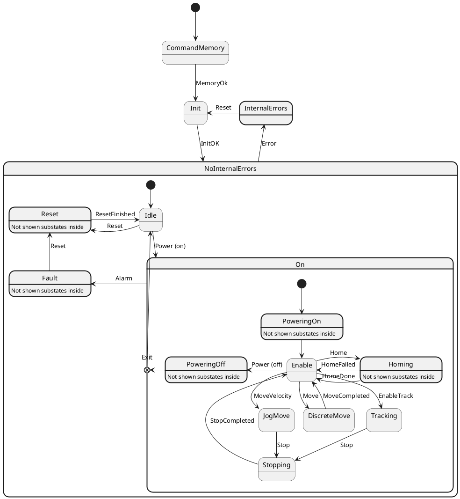
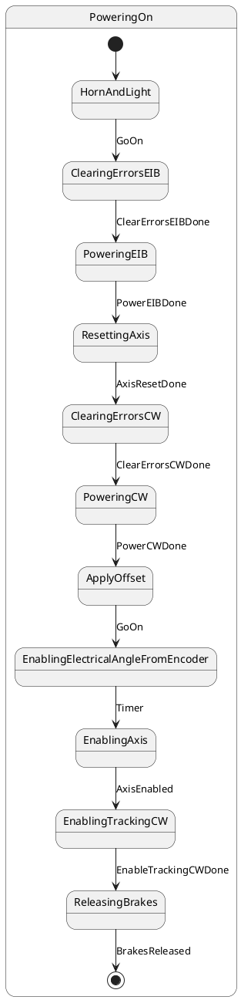
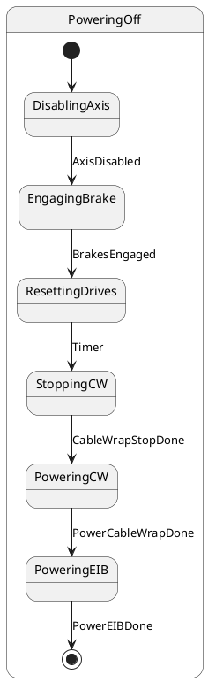
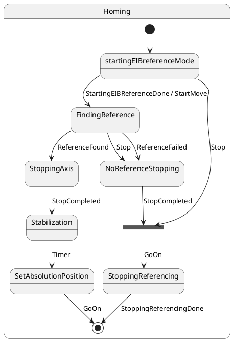
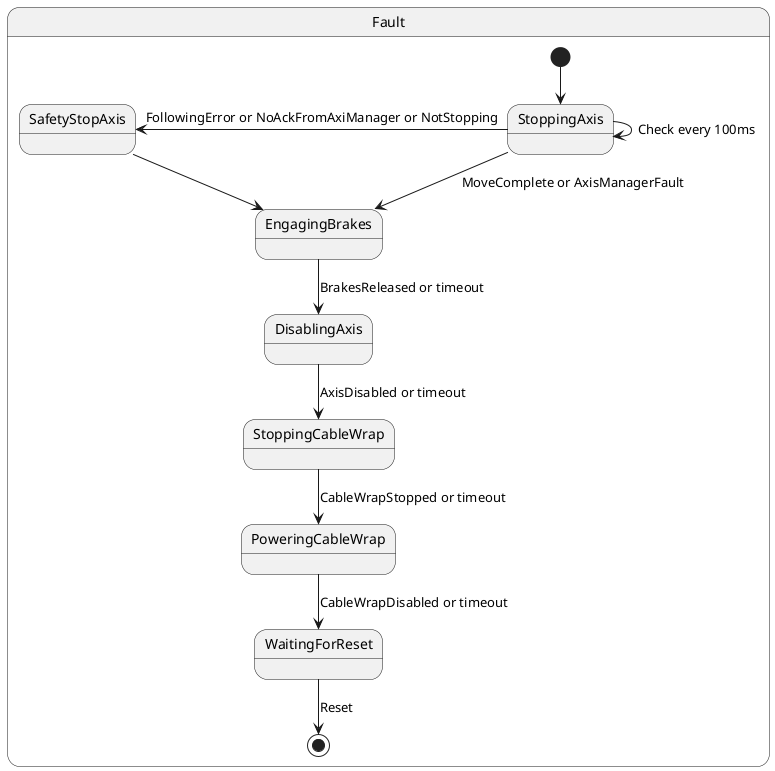

## State Machine

The behavior of the system is managed by the state machine. The state machine for main axes is shown in next diagram. The states with bold line are superstates that have substates inside. In order to make the state machine more understandable, for some superstates their inner substates are not shown, and the "Not shown substates inside" label is shown. Refer to the diagrams bellow to get information about the inner substates for those superstates.

For elevation axis the CW substates are skipeed.

For PoweringOn superstate the inner substates are shown in next diagram. All states named powering are states to power on elements.

For PoweringOff superstate the inner substates are shown in next diagram. All states named powering are states to power off elements.

For Homing superstate the inner substates are shown in next diagram.

For Fault superstate the inner substates are shown in next diagram.

### Homing superstate

As described in the [EIB hardware working](../06%20Subsystem%20EIB/06%20Hardware%20working.md/#Reference-Data), to get
the absolute position of the encoder, a procedure where the axis is moved must be done. Then the obtained reference is
applied to the axis manager in order to generate setpoints for absolute values. This superstate, is in charge of
managing all the actions to get the system ready to work as absolute position commanding.

The first action of homing procedure is to ask the EIB task to start looking for the reference
(see [command sequence](../06%20Subsystem%20EIB/05%20Commad%20sequences..md) for more info). Once the EIB is ready, the
axis is moved to search for the reference mark. When the reference is found the axis is stopped. Then the system just
waits for a stabilization time. This time ensures that the telescope is fully stopped in the desired position. After
this time the absolute position published by the axis ([Axis control](20%20Axis%20Control.md)) of the last 50ms is
obtained and the mean of that period is applied as absolute position. With the configured stabilization time the error
between the actual absolute position and the controlled position is always bellow the noise level of the encoder heads.

Other states of the superstates allow stopping the homing process by the user or to handle a failed reference.

### Fault superstate

When entering the fault superstate the axis is commanded to stop, if there is no a FollowingError fault active. In the case the FollowingError is active, the internal trigger safetyStop is sent and the state machine will do the transition to safetyStopAxis. Also if the axisManager does not answer to the stop axis the internal trigger safetyStop is sent.

In safetyStopAxis the safety system is asked to stop the axis.

The stoppingAxis state is checked every 100 ms (or faster, due to alarm triggers). This state will check if there FollowingError gets active and that the axis is stopping at a minimum speed rate of 1%. If one of these two conditions is not meet, then the safetyStop is triggered.

The stoppingAxis continues to EngagingBrakes if the axisManager detects a Fault or if the axisManager sends a movementCompleted.

The EngagingBrakes continues if Brakes are engaged or a timeout is ocurred.

From next substates up to WaitingForReset, the state machine goes on if the action is completed or a timeout for the action is reached. Also, for those cable wrap states, that are executed only for azimuth, a command failed also makes the system to continue to next state.

In last state WaitingForReset, the state machine will wait for a Reset command from the user or CSC.