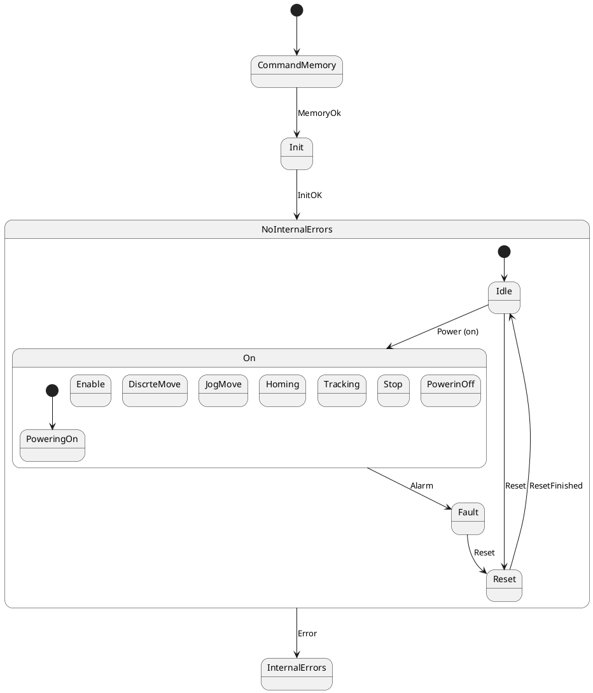

## State Machine
The behaviour of the system is managed by the state machine. The state machine for main axes is shown in next diagram

```plantuml

@startuml

state NoInternalErrors {
  
  state Idle  
  state On {
    state PoweringOn{

    }
    state Enable
    state DiscrteMove
    state JogMove
    state Homing
    state Tracking
    state Stop
    state PowerinOff{

    }
    


    [*] --> PoweringOn
    

  }
  state Fault {

  }
  state Reset{

  }

  [*] --> Idle
  Idle --> On : Power (on)
  On --> Fault : Alarm
  Fault --> Reset : Reset
  Idle --> Reset : Reset
  Reset --> Idle : ResetFinished


  
}

state InternalErrors {
}


[*] --> CommandMemory
CommandMemory --> Init : MemoryOk
Init --> NoInternalErrors : InitOK
NoInternalErrors --> InternalErrors : Error

@enduml

```