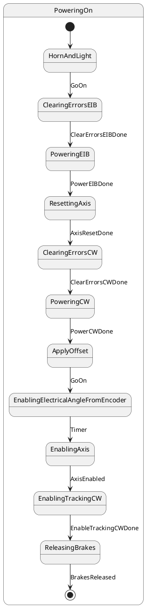
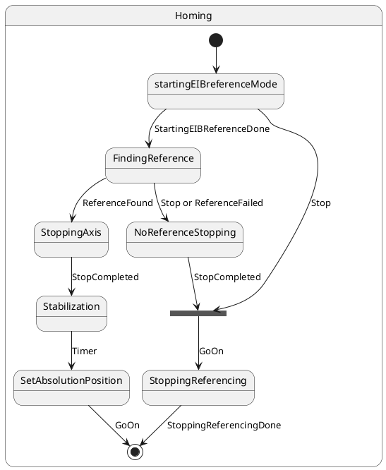

## State Machine
The behaviour of the system is managed by the state machine. The state machine for main axes is shown in next diagram. The states with bold line are superstates that have substates inside. In order to make the state machine more comprensible, for some superstates their inner substates are not shown, and the "Not shwon substates inside" label is shown. Refer to diagrams bellow to get info about the inner substates for those superstates without inner info shown.

For PoweringOn superstate the inner substates are shown in next diagram. All states named powering are states to power on elements.

For PoweringOff superstate the inner substates are shown in next diagram.All states named powering are states to power off elements.

For Homing superstate the inner substates are shown in next diagram

