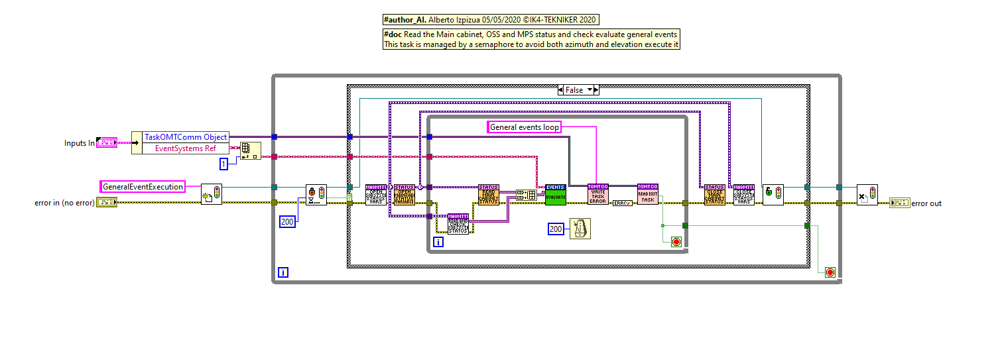
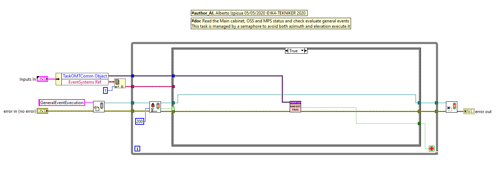
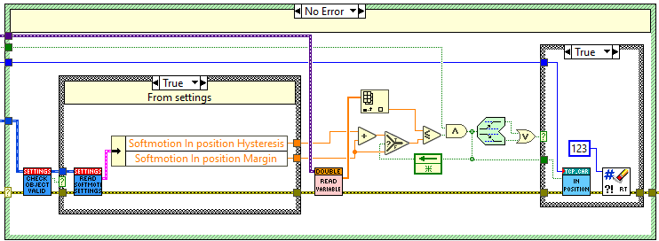
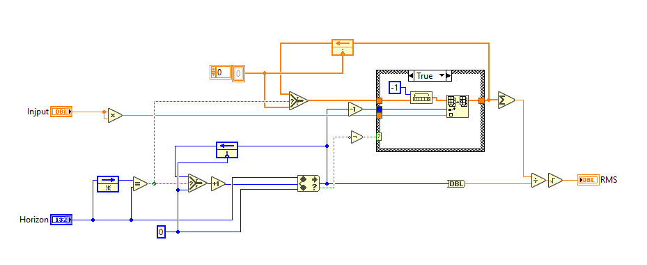
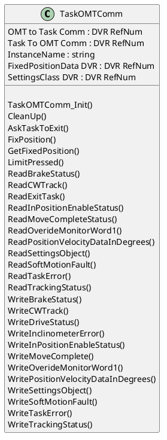

## Monitoring loop

The monitoring loop uses an instance of the same loop for both axes. The monitoring loop really consists in two loops, one for the events related to each axis, and another one for the general events that affects to both axis.

The monitoring loop executes in the TMAPXI every 50ms. But, as will be shown in next points a lot of date is coming from the AXESPXI.

### General events

This loop will evaluate the state of the general events that affects to both axes, like the OSS or Phase power supply status. This loop must be runs only ones, but must run in the case elevation or azimuth is running. To ensure that cases a semaphore is implemented, so that, the first axis running this loop will manage the general events for both axis, while the other axis will keep waiting for releasing the semaphore without doing nothing apart to check if the loop must be finished.

The general events are managed by the object of the EventManagement class

#### General events evaluation criteria

In this section the evaluation criteria for each even is shown.

This is an automatic table exported from the settings/events database.

### Axis Events

There are 3 kind of events that are monitored in this loop.

* Alarms/Warning events
* Events for state machine
* In position event

#### Alarms/Warnings events

These events are managed by the axis object of the EventManagement class. Here all the axis alarms and warnings are included, except the ones programmed as [General events](#general-events).

The data for these events (see [TMA Faults](https://gitlab.tekniker.es/publico/3151-lsst/documentation/tma-faults) for more info) are taken reading directly form the axis, or using the telemetry tasks that publishes data in variables or safety task All these values are sent to the Evaluate method of the EventManagement class.

##### Axis events evaluation criteria

In this section the evaluation criteria for each even is shown.

This is an automatic table exported from the settings/events database.

#### Events for state machine

This events are used to perform triggers in the state machine. Those trigger will trigger some transitions in the state machine, if the actual state allows it (see [State Machine](./04%20State%20Machine.md)). For instance, in the state NoInternalErrors/On/PoweringOn/EnablingAxis the state is waiting for the axis to be enabled. The axis is managed by [Axis Manager](./10%20Axis%20Manager.md) software implemented in the AXESPXI, so reading the data from the AXESPXI the monitoring loop will trigger the state machine with the trigger AxisEnabled when the AxisManger changes to enable state. This trigger will make the state machine to continue with the next state NoInternalErrors/On/PoweringOn/EnableTrackingCW.

##### State machine triggered in event loop

The communication between the monitoring loop and the state machine is done using an object of the class TaskOMTComm. The TaskOMTComm class has some methods that triggers the state machine. The class is more deeply explained in the [TaskOMTComm class](#taskomtcomm-class) section.

The methods used to trigger the state machine are:

* WriteDriveStatus. Triggers AxisEnabled or AxisDisabled.
* WriteMoveComplete. Triggers MoveComplete (this is filtered for the first time when there is a fault active)
* WriteSoftMotionFault. Triggers AxisReady when the axis fault is not on.
* WriteBrakeStatus. Triggers BrakesReleased and BrakesEngaged.
* LimitPreset. Triggers LimitePressed if any limit is pressed or exceed.
* WriteTrackingStatus. Writes TrackingStarted and TrackingStopped.

#### In position event

This event is an especial event that is used by the telescope software mainly to know when a slew is finished. This
event is sent directly from the monitoring loop to the CSC and has no effect in the state machine or any other management
or control code.

The in position evaluation is made in the TMA-PXI (in the monitoring loop) using the RMS value of the following error calculated in the AXES-PXI, [following error RMS calculation](#following-error-rms-calculation). The TMA-PXI executes the monitoring loop every 50ms, so it gets the last 50 points for the following error RMS. From this array of points the first one is selected and it is compared with the trigger setting value "Softmotion in position Margin". If the value is lower or equal to the setting "Softmotion in position Margin" the software will send the inPosition event as *True*. In the next iteration after the trigger, the following error RMS value is compared with "Softmotion in position Margin" + "Softmotion in position Hysteresis" and in case the following error RMS value is bigger than this sum an inPosition event is sent as *False*. Adding the "Softmotion in position Hysteresis" setting avoids the possible flickering of the event due to noise in the measured position signal.

A lower value of the "Softmotion in position Margin" setting makes to trigger the event inPosition when the telescope is closer to the commanded position, but the telescope needs more time to trigger the inPosition Event after an slew. Even a very small value could cause the event inPosition to never fire. As said before, the value of the "Softmotion in position Hysteresis" setting is to avoid event flickering, so a low value could make the event to trigger several times when the telescope is getting to the commanded position, and a high value could cause that the telescope is never out of inPosition, so adjusting this value is not trivial.

##### following error RMS calculation

The following error is the difference between the set point and the actual position in each instant of time. The set point is generated by the trajectory generator, while the actual position is the position read by the encoder heads.

$$
followingError = setPoint - actualPosition
$$

The RMS of this instant value is made for a settings defined time ("Softmotion in position buffer size", with a recommended value of 1000 that means a buffer size for one second). The formula applied is shown next to these lines and the implementation is shown in the figure.

$$
followingErrorRMS = \sqrt{\sum_{k=1}^n followingError^2 \over n}
$$

where  n = Softmotion in position buffer size

The calculated values for every instant of time are sent to the TMAPXI.

A change in the buffer size makes to restart the RMS calculation.

### TaskOMTComm class

This section describes the TaskOMTComm class used to communicate between the monitoring loop and the state machine.

