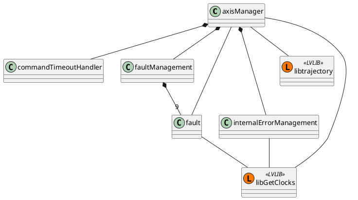
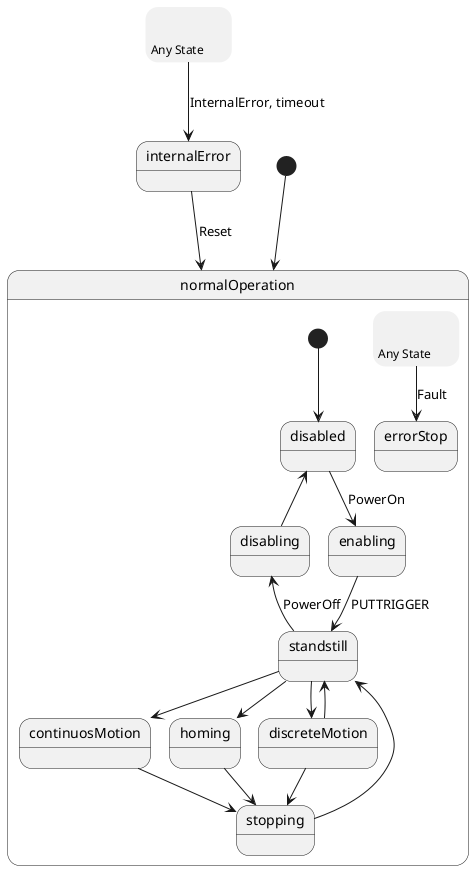
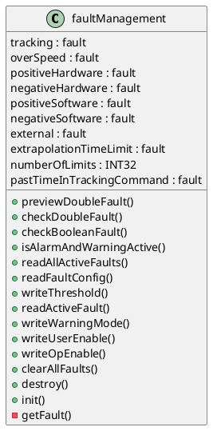
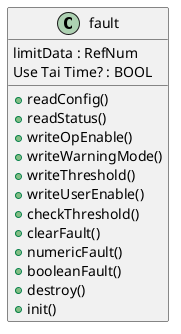
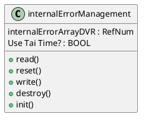
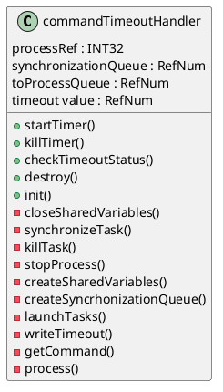
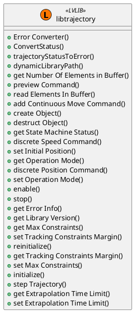

## Axis manager

This section describe the code for the axis manager. The axis manager is the replacement for NI Softmotion axis. The
axis manager software includes the management of the trajectory generation and the status of the axis, implementing some
alarms and faults.

TODO: complete the intro with classes info

### axisManager class

The class has the structure shown in next uml diagram.

The main functionality of this class is in the private method process, explained [here](#process),

```plantuml
@startuml

class axisManager{
    processRef : RefNum
    synchronizationQueue : RefNum
    toProcessQueue : RefNum
    axisManagerInput : RefNum
    axisManagerStatus : RefNum
    stateMachineStatus : RefNum
    maxConstraints : RefNum
    faultStopConstraints : RefNum
    trackingSlewingConstraints : RefNum
    trajectorySetpoint : RefNum
    axisEnabledFeedback : RefNum
    synchronizedTrajectorySetpoint : RefNum
    currentCommand : toProcessCluster_Typedef
    commandTimeoutHandler : commandTimeoutHandler
    exitSynchronousLoops : RefNum
    trajectoryHandle : INT64
    referenceOutput : RefNum
    faultManagement : faultManagement
    synchronousLoopConfig : synchronousLoopConfigCluster_Typedef
    referencingSpeed : DBL
    axisName : STRING
    outputCommand : RefNum
    Use Tai Time? : BOOL
    internalErrorManagement : internalErrorManagement
    extrapolationTimeExpired : BOOL
    operationalMode : RefNum
    MutexForCallingTrayectoryGenerationLibrary : RefNum

    {method}
    +readAxisManagerOutputs()
    +readLimitConfig()
    +readStatus()
    +readActiveAlarms()
    +readActiveWarnings()
    +readMaxConstraints()
    +readTrackingSlewingConstraints()
    +readTrackingConstraintsMargin()
    +readCurrentMoveConstraints()
    +readInternalError()
    +readFaultStopConstraints()
    +readReference()
    +readTrajectorySetpoint()
    +readAxisFeedback()
    +readAxisManagerStateMachineStatus()
    +writeAxisManagerInputs()
    +readSynchronizedTrajectorySetpoint()
    +readOutputCommand()
    +readElementsInBuffer()
    +writeLimitThreshold()
    +writeLimitEnable()
    +reset()
    +enable()
    +writeReference()
    +stop()
    +searchReference()
    +moveContinuous()
    +movePosition()
    +moveSpeed()
    +writeFaultStopConstraints()
    +writeTrackingSlewingConstraints()
    +writeMaxConstraints()
    +writeTrackingConstraintsMargin()
    +destroy()
    +init()
    +GetAxisName()
    +ReadAxisData()
    -closeInternalSharedVariables()
    -closeSharedVariables()
    -synchronizeTask()
    -killTask()
    -stopProcess()
    -calculateGetSetpointDT()
    -createInternalSharedVariables()
    -createSharedVariables()
    -createSyncrhonizationQueue()
    -launchTasks()
    -checkAxisName()
    -WaitScanEngineReady()
    -resetReference()
    -writeOutputCommand()
    -externalDisableAction()
    -moveGuard()
    -writeFaultStopConstraintsDVR()
    -writeLimitEnableAction()
    -writeExitSynchronousLoops()
    -writeEnableOutput()
    -readExitSynchronousLoops()
    -writeAxisManagerStatus()
    -writeMaxConstraintsDVR()
    -moveContinuousAction()
    -stopAction()
    -limitReachedAction()
    -homingLimitAction()
    -setInitialPositionAction()
    -launchTimer()
    -internalErrorAction()
    -notAllowedCommand()
    -writeLimitThresholdAction()
    -enableAction()
    -homingAction()
    -writeFaultStopConstraintsAction()
    -plcOpenInfo()
    -readAxisControlCluster()
    -movePositionAction()
    -moveSpeedAction()
    -checkSoftwareLimitInterlock()
    -exitPressedLimitAction()
    -writeTrackingSlewingConstraintsDVR()
    -resetAction()
    -getCurrentTime()
    -setContinuousMode()
    -writeReferenceDVR()
    -writeInternalErrorOutput()
    -checkActiveInterlocks()
    -writeCurrentMoveConstraints()
    -writeErrorStopOutput()
    -faultAction()
    -writeSpeedCommandConstraints()
    -writeTrackingSlewingConstraintsAction()
    -disableForErrorStopAction()
    -writeReferenceAction()
    -enableSoftwareAndHardwareLimits()
    -constraintsToStopConstraints()
    -convertToAbsolutePosition()
    -writeMaxConstraintsAction()
    -syncTask()
    -timeoutAction()
    -internalErrorCommonAction()
    -compareDoubles()
    -getStopConstraints()
    -writeTrackingConstraintsMarginAction()
    -reinitializeTrajectory()
    -WriteOperationalMode()
    -readOperationMode()
    -Done()
    -waitForAnswer()
    -parseTimeoutMessage()
    -ack()
    -writeCommandCore()
    -timeout()
    -parseNoAckMessage()
    -parseAnswer()
    -noAck()
    -answerToCommand()
    -getNextCommand()
    -ackAndDone()
    -writeToProcessQueue()
    -abortCommand()
    -writeActiveWarnings()
    -checkHomingLimits()
    -checkLimitFaults()
    -latchLimit()
    -checkTrackingAndSpeedFault()
    -hardwareLimitsFault()
    -commandTimeout()
    -writeActiveWarningsOutput()
    -writeAxisEnabledFeedback()
    -triggerEvent()
    -writeEvent()
    -systemEnable()
    -discreteMoveFinished()
    -checkExtrapolationTimeFault()
    -checkExternalFault()
    -checkSoftwareLimits()
    -readAxisManagerInputs()
    -readAxisEnabledFeedback()
    -monitoring()
    -latchHardwareLimits()
    -internalFaultStateMachine()
    -homingStateMachine()
    -errorStopStateMachine()
    -stateMachine()
    -normalOperationStateMachine()
    -writeSyncrhonizedTrajectorySetpoint()
    -writeTrajectorySetpoint()
    -getTrajectorySetpoint()
    -internalErrorHandling()
    -process()
}

@enduml
```

This is the main class of the Axis Manager.

#### init

This is public method that initialized the object.

1. Check that the name of the axis is not already used or empty. Error -8102 if empty and Error -8103 for already used name.
2. Create the synchronization queue. NOT QUEUE SIZE.
3. Create some data references. No values are added in queues and DVRs have the default control value (zeros..)
    * To process queue. NOT QUEUE SIZE.
    * Axis Manager input DVR.
    * Axis manager status DVR.
    * State machine status DVR.
    * Trajectory Setpoint DVR.
    * Reference output (Home) DVR.
    * Fault stop constrains (settings for fault stop) DVR.
    * Max constraints (maximum allowed performance settings) DVR.
    * Tracking and Slewing Constrains DVR.
    * Axis Enable feedback DVR
    * Sync Setpoint RT FIFO
    * Output command QUEUE. NOT SIZED.
    * Operational mode. DVR.
4. Write max constrains. Data comes from the input
5. Write tracking and slewings constrains. Data comes from the input
6. Library call mutex. Create if the input is not valid.
7. Create Object for timeout
8. Create trajectory object. Call the trajectory library to get the object handle
9. Calculate the get setpoint dt.
10. Initialize trajectory. Call the initialize function, with slew constrains, tracking constrains, slewing parameters and tracking parameters settings, DT and buffer size. 
11. Create fault manager object
12. Write threshold for extrapolation time limit
13. Disable following error
14. Crete Internal error management object
15. Launch task. Call and forget.

#### getAxisName

This is a public method that returns axis name property

#### readAxisData

This is a public method to get the actual position and setpoint.

1. Get reference offset
2. Get setpoint data. DVR
3. Get position feedback DVR.

#### destroy

This is a public method to clean up the axis object

1. Stop the process. Send a stop cmd and if no response is get in the allowed timeout the process is killed.
2. Close Variables
    * trajectorySetpoint DVR
    * faultStopConstrains DVR
    * referenceOuput DVR
    * stateMachineStatus DVR
    * axisManagerStatus DVR
    * axisMangerInput DVR
    * axisEnabledFeedback DVR
    * toProcessQueue Queue
    * synchonizedTrajectorySetpoint RT FIFO
    * OutputCommand Queue
    * maxConstrains DVR
    * trackingSlewingConstraints DVR
    * OperationalMode DVR
3. Destroy trajectory object. Call trajectory library method
4. Destroy timeout object
5. Destroy faultmanagement object
6. Destroy internalErrorManagement
7. Destroy mutex. NOT PROPERLY DONE, it must have a property to destroy if the object create the DVR, otherwise no.

#### readAxisManagerOutputs

Read the data for axis control

1. readOperationMode. From DVR
2. readAxisControlCluster. Axis Status. From DVR. #Optimizable
3. ReadSyncTrajectorySetpoing. From  RT FIFO. #Optimizable

#### readLimitConfig

Read the limit configuration from faultManager object. The limit desired to check the configuration is defined by input.

1. Get faultManagerObject from the axis object
2. readFaultConfig method of faultManager class

#### process

The process has basically two elements, the state machine [StateMachineName](#statemachine)

TODO:correct this links and names

#### statemachine

The state machine is based on PLC open state machine.

### faultManagement class

### fault class

### internalErrorManagement class

### commandTimeoutHandler class

### libtrajectory class

