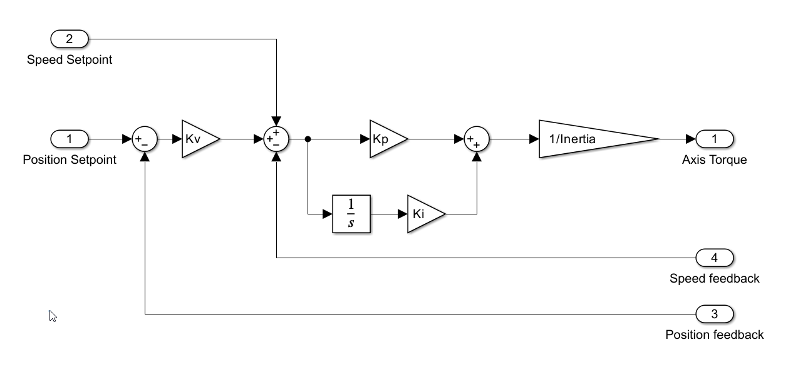

## Axis control

This section describes the control algorithm for azimuth and elevation axes.

The control algorithm performs the main actions listed bellow. They are done in the written order. Some management
actions are not listed for simplicity.

* Read Drives System Data
* Get User Command
* Get Position Feedback
* Execute Control Algorithm
* Calculate Electrical Angle
* Write Drives Data
* Write Axis State
* Publish Data
* Update Settings

### Read drives system data

### Get user command

### Get position feedback

This function waits up to 100us to get a new value from the EIB. If the data arrives on time it calculates the mean value
for relative positions, speed from EIB, and absolute positions.

For relative positions, only the heads without error are used for the calculation. If one head fails while the system is
working, the mean will not use the failed head to calculate the mean automatically. This position is the one used by
control algorithm to control the axis (see [Position control algorithm](#position-control-algorithm) section).

For absolute position, only the heads with a reference valid flag are used to calculate the absolute mean value. This
value is not used in the control algorithm for anything.

If data is not received on time, the data will be extrapolated with the last valid data. This extrapolation is done for
each head data and for the axis data (valid heads data mean).

### Execute control algorithm

In this function the control algorithms are executed. For both axis the position control algorithm is executed. For
Azimuth, the damping control algorithm is also executed.

#### Position control algorithm

The position control algorithm calculates the torque needed to make the actual position match the setpoint position.

The position control used is a standard used for precise positioning control.

As can be seen in the diagram above, the actual position is compared with the actual setpoint, and using a gain the speed
setpoint is calculated. This speed setpoint is compared with the actual speed to apply a PI (proportional and integral)
to obtain the acceleration setpoint. This acceleration setpoint is converted to a torque setpoint. Lastly the total
torque is divided into the active drives, that would be sent to the motors in the write drives data step.

The control includes a speed feedforward. The speed feedforward applies the speed setpoint calculated by the trajectory
generator directly to the speed setpoint in the control algorithm. The speed feedforward eliminates the position error
when the axis is moving, but it generates an overshoot when the axis is stopped or when there is a speed change.
The feedforward is necessary during tracking, to eliminate the tracking following error but the overshoot could increase
the stabilization time after an slew. To avoid this, the feedforward is deactivated as soon as an slew is detected by the
trajectory generator. The feedforward is then activated once the slew is finished in a gradual way, to avoid any
undesired perturbation.

In the control loop algorithm, the position variable is always the same to avoid any steps after doing the reference.
An step in the position means a step in torque. As the only variable that is valid from the start of the EIB is the relative position,
the used position for control the axis is the relative position. The absolute position will be an offset for the trajectory
generator that would applied to the generated trajectory to command the axis with the equivalent relative position reference.
This offset value is updated with the command writeReference (see [Axis Manager](10%20Axis%20Manager.md) for more info).
