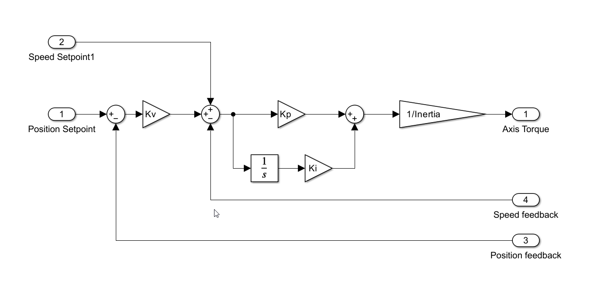

## Axis control
This section describes the control algorithm for azimuth and elevation axis

The control algorithm performs the main actions listed bellow. They are done in the written order. Some management actions are not listed for simplicity.

* read drives system data
* Get user command
* Get position feedback
* Execute control algorithm
* Calculate electrical angle
* Write drives data
* write axis state
* publish data
* update settings

### Read drives system data

### Get user command

### Get position feedback

The function wait up to 100us to get a new value from the EIB. If the data arrives in time it calculates the mean value for relative positions, speed from EIB, and absolute positions. 

For relative positions, only the heads without error are used for the calculation. If one head fails while the system is working, the mean will not use failed head to calculate the mean automatically. This position is the one used by control algorithm to control the axis (see [Position control algorithm](#position-control-algorithm) section).

For absolute position, only the heads with a reference valid flag are used to calculate the absolute mean value. This value is not used in the control algorithm for anything. 

If data is not received in time, the data will be extrapolated with the last valid data.This extrapolation is done for each head data and for the axis data (valid heads data mean).

### Execute control algorithm

In this function the control algorithms are executed. For both axis the position control algorithm is executed. For Azimuth, the damping control algorithm is also executed.

#### Position control algorithm
The position control algorithm calculate the torque to ensure that the position is close to the setpoint.

The position control used is a standard used for precise positioning control.

As can be see in the diagram the actual position is compared with actual setpoint, an using a gain the speed setpoint is calculated. This speed setpoint is compared with actual speed to apply a PI to obtain the acceleration setpoint. This acceleration setpoint could be converted to torque setpoint. Lastly the total axis torque is divided into the active drives, that would be sent to the motors in write drives data step.

The control has also an speed feedforward. The speed feedforward is direct apply of the speed setpoint calculated by the trajectory generator to the speed setpoint in the control loop algorithm. The speed feedforward allows to eliminate the position error when there is movement in the axis, but it generates an overshoot when the axis is stopped or when there is a speed change. The feedforward is necessary to eliminate the tracking following error but the overshoot would make to increase the stabilization time after an slew. To avoid this, the feedforward is deactivated as soon as an slew is detected by the trajectory generator. The feedforward will be activated after the slew is finished in a gradual way, again to avoid any undesired perturbation.

In the control loop algorithm, the position setpoint is always the same to avoid any steps when doing the reference. An step in the position means a step in torque. As the only valid value all the axis control live is the relative position, the used position for control the axis is the relative position. The absolute position will be an offset for the trajectory generator that would apply to the generated trajectory to command the axis with the equivalent relative position reference. This offset value is updated when the command writeReference (see [Axis Manager](10%20Axis%20Manager.md) for more info).
