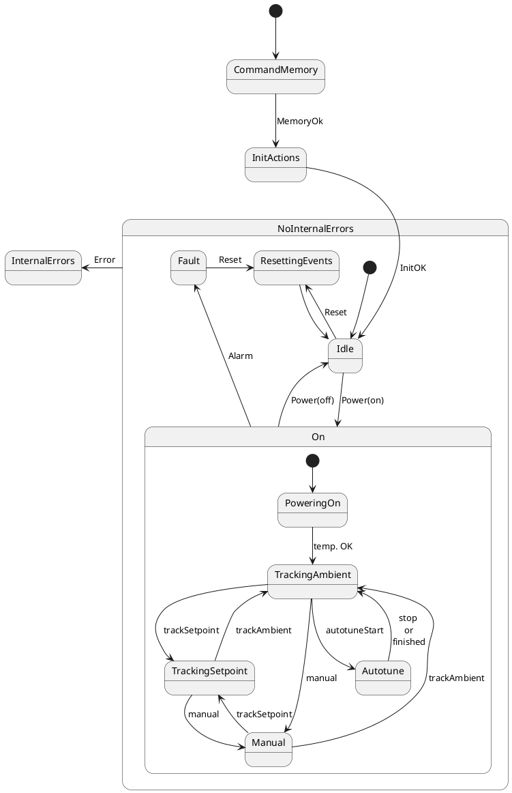

## State Machine

The behavior of the system is managed by the state machine. The state machine is represented in the diagram below.

```plantuml
@startuml
state NoInternalErrors {
  state Idle
  state On {
    state PoweringOn
    state TrackingAmbient
    state TrackingSetpoint
    state Manual
    state Autotune

    [*] --> PoweringOn
    PoweringOn --> TrackingAmbient : temp. OK
    TrackingAmbient --> TrackingSetpoint : trackSetpoint
    TrackingAmbient --> Manual : manual
    TrackingAmbient --> Autotune : autotuneStart
    TrackingSetpoint --> TrackingAmbient : trackAmbient
    TrackingSetpoint --> Manual : manual
    Manual --> TrackingAmbient : trackAmbient
    Manual --> TrackingSetpoint : trackSetpoint
    Autotune --> TrackingAmbient : stop \nor\nfinished
  }
  state Fault
  state ResettingEvents
  
  [*] --> Idle
  Idle --> On : Power(on)
  On --> Fault : Alarm
  On --> Idle : Power(off)
  Fault --r> ResettingEvents : Reset
  Idle --> ResettingEvents : Reset
  ResettingEvents --> Idle
}

state InternalErrors {
}

[*] --> CommandMemory
CommandMemory --> InitActions : MemoryOk
InitActions --> Idle : InitOK
InitActions -[hidden]-> NoInternalErrors
NoInternalErrors -l-> InternalErrors : Error

@enduml
```
