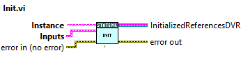

# Tekniker Statechart

This repo contains a library to replace the NI statechart module.

## Statechart template explanation
The library **TeknikerStatechart.lvlib** has implemented a basic template for an state machine.
This state machine has one state that is a superstate with another state machine inside, and this second state machine has another state that is a superstate with another state machine inside. Each superstate, and main state machine are one library inside the *SuperStates* folder in the TeknikerStatechart.lvlib library
The template statechart is based on the state machine of the figure 

The main state machine is composed by 4 states Init, NoError, InternalError and Deinit. The logic of this state machine is in the library *SuperState1.lvlib*.

The second state machine is inside the NoError superstate and has defined three states Idle, On  and Fault. The logic of this superstate is in the library *SuperState_NoError.lvlib*.

In the second state machine, the On state is a superstate with the state machine shown in the next figure. This superstate has 4 states, Enable, DiscreteMove, ContinuousMove and Stop. The logic of this superstate is in the library *SuperState_On.lvlib*.

## How to use

This section describes how to use a already programmed statechart. To program the statechart go to [How to program](#how-to-program) section.

### Init statechart
This vi will start all necesary elements for usign the statechart. The VI has two mandatory inputs.

* Instance. Define the instance of the statechart. Several instances of the statechart can be called. **At this moment of development there are three VIs that must be changed to reentrant for using the statechart as reentrant: Diagram.vi, DiagramBeforeCaseActions.vi and checkExternalTriggers.vi**. The last two are located in the *private/DiagramBeforeAndAfterCaseVIs* folder.
* Inputs. This input is the inputs to the statechart that will be updated only in the init. This inputs will be available inside the statechart diagram.

### Diagram
This VI is the statechart itself. This must be called in a loop. It has two ouputs, apart from the input/output with statechart data.
* ActualState. This will provide the actual state of all state machines separated by a "\\"
* ExitStatechart. This output will be true when the statechart has finished all the executions. All state machines goes to end point.

### Exit
This VI will execute the clean up actions related with the statechart. 

### Trigger statechart
To trigger the statechart the TriggerStatechart.vi must be used. This VI could be use in a separate loop an it needs the instance of the statechart to trigger, and the trigger itself.

### Example code
Next figure shows an example of how to use the generated library.

## How to program

The *TeknikerStatechart.lvlib* is a template so the first step is to **save a copy of the library *TeknikerStatechart.lvlib***. All modifications must be done in the copied library.

Then next steps are recommended
 1. Rename superstates names to desired names
 2. If the statechart has more superstates, clone one of the supplied superstates libraries.
 3. Modify triggers for the state machine
 4. Modify states of each superstate
 5. Start programing the diagram

Next topics gives more information about different elements of the statechart and how to use them.

### Init and exit actions
**DO NOT MODIFY** Init and Exit VIs. If initialization actions are needed put them in init and deinit states inside the statechart.

### Triggers
Triggers are general for all the the statechart and they can be defined in the **ExternalTriggers_TypeDef.ctl** under the *Controls* folder in the main lvlib. **DO NOT REMOVE/CHANGE**  the first (NULL) and last (InternalStatechart_Exit_NOTREMOVE) tiggers.

To generate a trigger there are two different VIs

* TriggerStatechart.vi. Use this vi to trigger the statechart from ousite the diagram. See [Trigger statecchart](#trigger-statechart) section.

* internalTriggerStatechart.vi. Use this vi to trigger the statechart form inside the diagram. Internal triggers will be checked before external trigger and no external trigger will be attended until all the internal triggers are attended. This vi needs the queue reference for internal triggers. This queue reference is only available in vis that belongs to the main library using the **Get_InternalTriggerQueue.vi**. The trigger is the other input of the vi.

### States
States are defined for each superstate in the **StatesAndTransitions_typeDef.ctl** under the *Controls* folder of each state machine library. In this control, the States and the transtions must be defined. In this control **DO NOT REMOVE/CHANGE** the first (StatechartStartPoint) and last (StatechartEndPoint) elemnts.

Each state state has included a case with three cases EntryActions, StateAction and exit actions.

#### Entry Actions
This is are the actions that must be performed when the state machine enters one state. This will be executed ones.

In this case the **LogicFor_EntryActions.vi** of the corresponding state machine must placed. This vi could be found under *the GeneralLogic* folder of each state machine. This code allows the state machine go on to next step.

Also the case structure for debug must be placed. If the case is part of the template a #codeHere tag will be found in the place where the code for the entry actions must be placed.

#### State Action
In the state action the code for state must be placed. This code include the static reactions and the logic for transitions to other states in the same machine. Also, inside the state action a child state machine can be placed. For instance, in the example of the template the NoError state machine code will be placed inside the state action of the NoError state of the SuperState1 state machine.

If a state machine in a given state has static reactions, and also another state machine inside, place the static reations before calling to the lower state machine code. In the figure, Parent and child logic figure, the static reactions vi for parent state machine is squared in red. The parent state machine is in the StateAction of NoError state, also red squared. Also the static reactions for the child is shown for the child state machine. The child state machine is in StateAction of Idle state, all blue squared with static reactions for Idle state.

In the template the transition logic for the state machine is implemented in VIs with **LogicForSubstate_EstateName.vi**, where a vi for each state can be found. This VI must have a boolean output for validating the transition and the definition of the next state. Those output must be wired to **LogicFor_StateActions.vi** inputs. If a guard must programed put it inside the **LogicForSubstate_EstateName.vi** managing the output TriggerValid? to False if the guard do not accept the trigger or to True if the guard accept the trigger.

Example of logic for a state action with guard

Example of logic for a state action without guard

If the state has a state machine inside, the VI **ManageTriggerForParentSuperState.vi** must be placed. This vi will manage the trigger from parent state so if the trigger is valid for parent state the vi will enqueue exit actions for actual subState of the child state machine and it will set the next state of the child state machine to be StatechartEndPoint. Otherwise it will do nothing. See orange square in NoError parent state in the Parent and child Logic example.

If a the trigger makes the state machine go to the end point, and the state machine is inside another state machine the **LogicFor_StateActions.vi** of the parent state machine must be used to define the state/transition to where the parent state machine will go. See orange square in Idle child state for Parent and child Logic example.

#### Exit Actions
This is are the actions that must be performed when the state machine exits one state. This will be executed ones.

In this state the *LogicFor_ExitActions.vi* of the corresponding state machine must placed. 

Also the case for debug must be placed. If the case is part of the template a #codeHere tag will be found in the place where the code for the exit actions must be placed.

#### Transitions
A transition is defined in the **StatesAndTransitions_typeDef.ctl** like an state, and it is programed in a case of the case structure. The transition has not internal case for action, it only has the code for the action of the transition and the logic for next state.

The logic for next state is made using the vi **LogicFor_Transition.vi** of the corresponding state machine, and the code of the transition must be placed inside the debug false case. In the templace a #codeHere tag could be found

If a transtion of a state machine makes a parent state machine to go to another state, the **LogicFor_StateActions.vi** of the parent state machine must be used to define the state/Transition to the parent state machine will go. **The transition of the parent state machine will be done after the child state machines go to end point.**

#### Statechart Start Point
This is a special state for all statecharts where the statechart will start. #codeHere tag is defined to define the next state (the real first state of the statechart)

#### Statechart End Point
This is very last state of an state machine. This is mostly and internal state, but something could be programed inside it. 

The logic for end point must be included in this state (**LogicForSubstate_StatechartEndPoint.vi**), that makes that next state is the statechart start point. This VI is included in the template.

